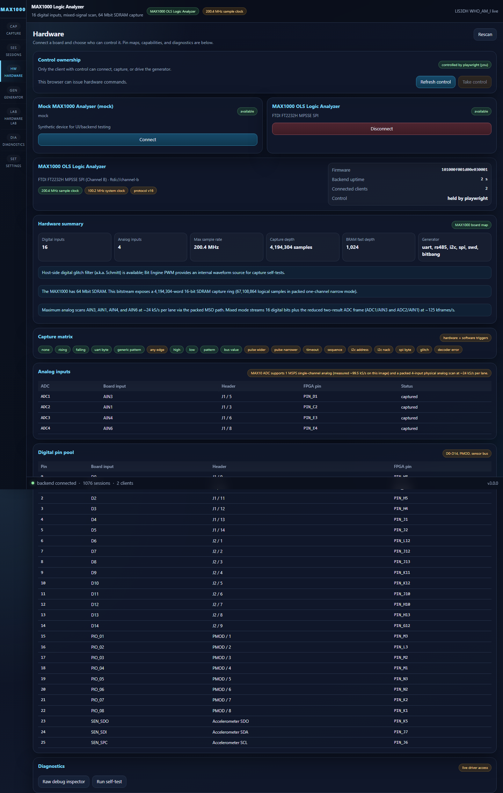
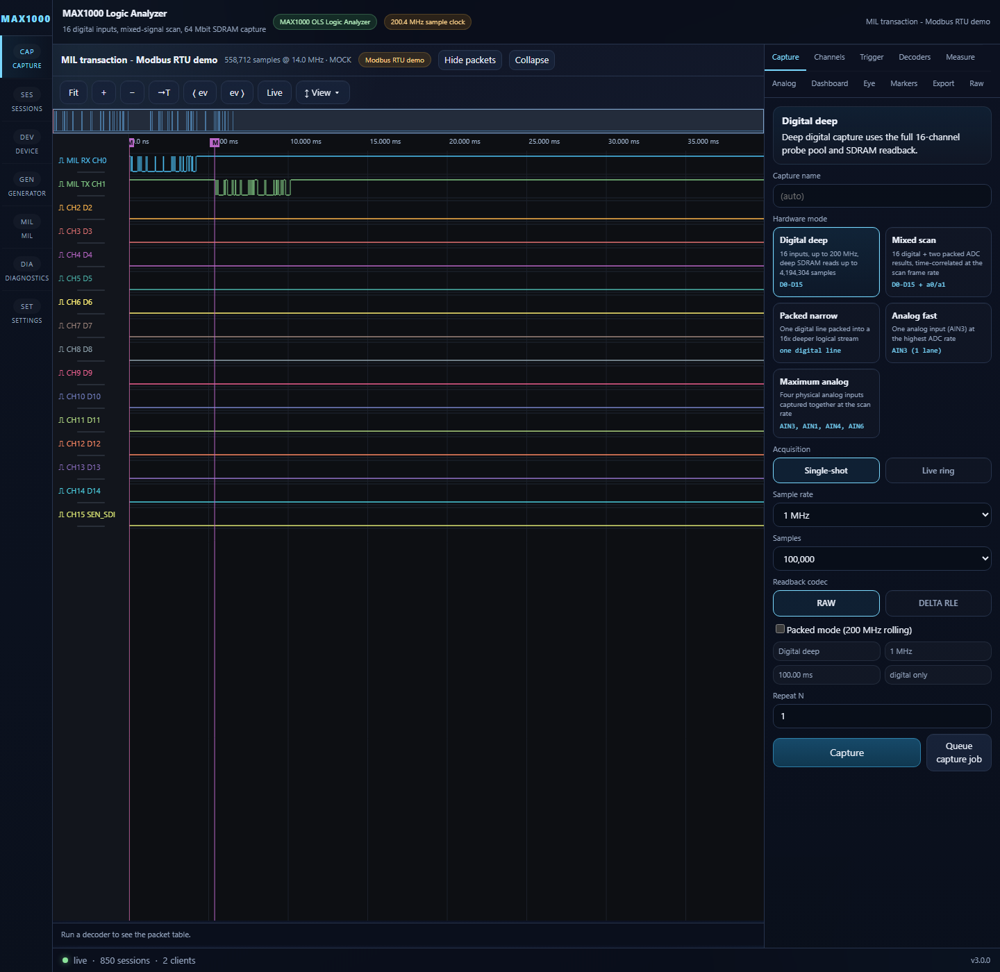
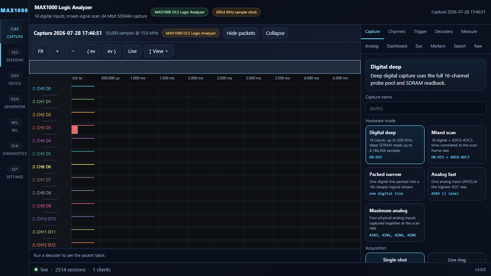
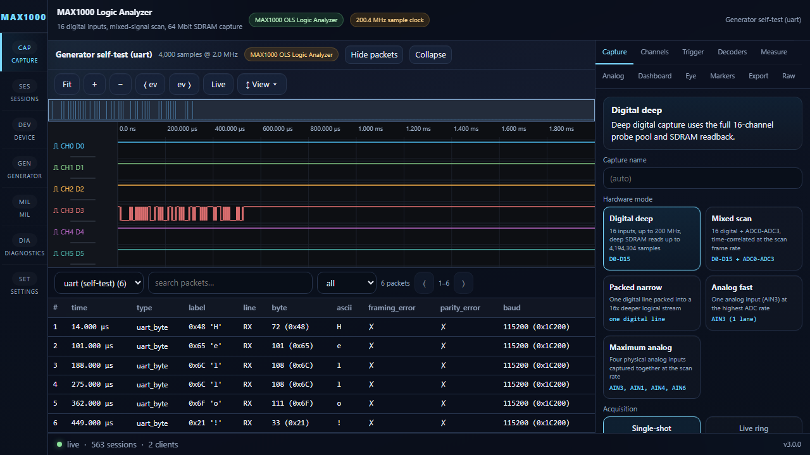
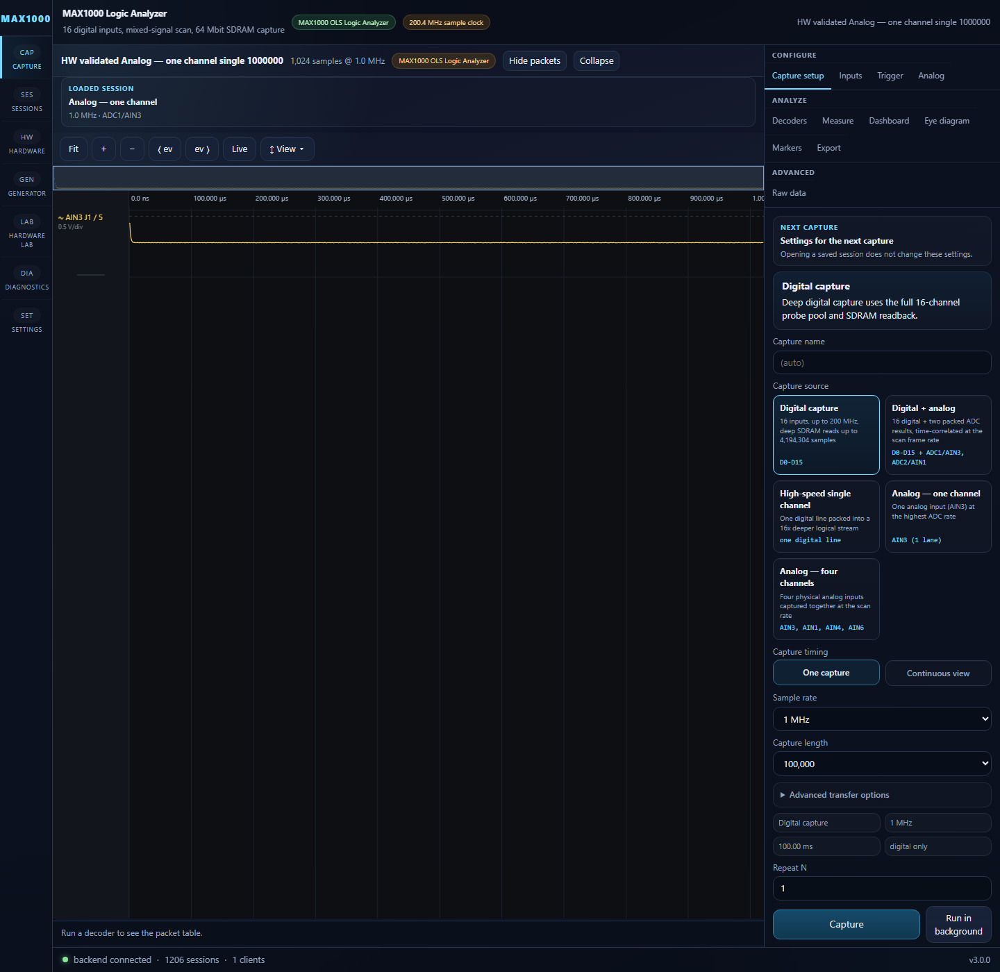
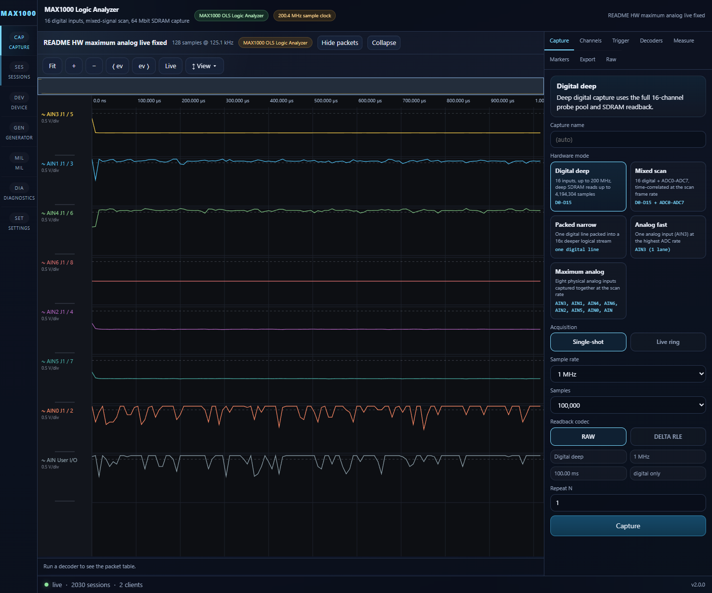
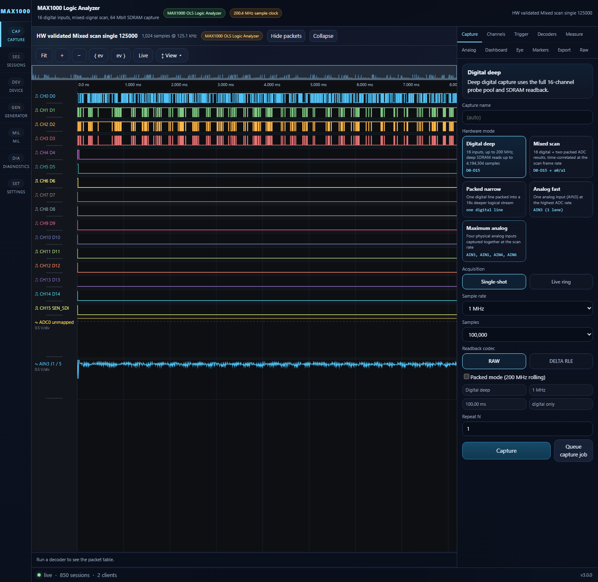

# OLS Logic Analyzer for MAX1000

OLS is a mixed-signal logic analyzer, capture backend, and signal-generator
stack for the Arrow MAX1000 board built around the Intel MAX 10 10M08. The
current repository includes:

- FPGA RTL for 200 MHz digital capture with SDRAM-backed deep storage
- The original Python host driver and tkinter tooling in [`host/`](host/)
- A FastAPI backend plus React frontend for browser-based capture and analysis
- Hardware validation, smoke tests, and regression tests for host, backend, and UI

The checked-in image and host stack are validated against the current MAX1000
bitstream behavior, including the narrower current analog feature set.

## Current Status

This repository is currently verified for:

- 16-channel digital capture up to the full 200.4 MHz sample clock
- Deep SDRAM single-shot capture up to `4,194,304` 16-bit words
- Packed narrow digital capture at 200 MHz for one selected channel
- Mixed capture with 16 digital bits plus the ADC0..ADC3 scan
- Analog-fast capture of 1 ADC lane
- Maximum-analog capture of 4 physical analog inputs
- UART, RS-485, I2C, SPI, SWD transaction capture, and raw two-output Bit Banger generation
- Browser UI, backend API, and classic host-driver workflow

Latest validation baseline (2026-07-23):

- `backend/app/tests`: `325/325` passed
- `host/tests/` + `host/driver/tests/`: `422/422` passed
- `frontend` typecheck and production build: passed
- `backend/hw_smoke_test.py`: `10/10` passed (hw) on programmed seed-44 SOF checksum `0x00515DB0`
- Full connected-fixture hardware regression: **358/358 passed, 0 failed, 0 skipped**
- Includes new pattern trigger tests: Test 14f (internal FSM) and 14g (UART 0x55 through physical jumper, match_mask=0xFF)
- Backend/host test suites: `747/747` combined; frontend typecheck/build: passed

## What The Current Bitstream Actually Does

### Digital

- 16 digital inputs from a programmable pin pool
- 200.4 MHz sample clock in the validated FAST build
- 1024-word BRAM fast path for small captures
- 64 Mbit SDRAM deep capture path for large single-shot and bounded live workflows
- Narrow packed mode stores 16 time samples for one selected channel in each 16-bit word

### Analog and Mixed

The current hardware exposes two analog capture profiles plus the mixed scan.

- `analog_fast`: 1 ADC lane, currently `ADC1 -> AIN3`
- `analog_all` / "Maximum analog": `ADC1,2,3,4 -> AIN3, AIN1, AIN4, AIN6`
- `mixed`: 16 digital bits plus the `ADC0..ADC3` mux scan in one time-correlated frame

On MAX1000, the current mixed mode is a 4-lane scan aligned with the four
analog inputs wired in the RTL. The maximum-analog profile is the physical
4-input scan.

### Readback Compression

Digital readback supports:

- `raw`
- `delta_rle` packed-delta-plus-RLE and direct `rle` in the host/UI surface

For the currently validated hardware block-read path, compressed capture blocks
decode from exact RLE block payloads with zero raw-retry fallback on the tested
board. On a recent hardware check with a compressible digital waveform, the
compressed block-read path delivered about `1.81x` faster readback than raw.

Analog and mixed captures use raw readback.

## Clock and Memory Summary

The validated FAST build uses one PLL with these main domains:

| Output | Frequency | Purpose |
| --- | --- | --- |
| `c0 -> sys_clk` | 100.2 MHz | SPI packet protocol, generator, UI-facing control logic |
| `c1 -> fast_clk` | 200.4 MHz | Digital sample capture and packing |
| `c2 -> sdram_core_clk` | 167 MHz | SDRAM controller, write pump, readout |
| `c4 -> sdram_chip_clk` | 167 MHz, phase-shifted | Forwarded SDRAM device clock |

Main storage paths:

- `1,024`-word BRAM capture path
- `4,096`-word async FIFO between capture and SDRAM
- `4,194,304` 16-bit SDRAM words for deep capture / bounded ring workflows

## UI Screenshots

All screenshots below were captured from the attached MAX1000 hardware on
July 7, 2026. No mock sessions are used in this gallery.

### Device Overview



### Capture Mode Controls



### Generator Loopback Capture



### Accelerometer Live Capture



### Analog-Fast Hardware Waveform



### Maximum-Analog Hardware Waveform



### Mixed Digital + Analog Hardware Waveform



*Note: this screenshot was taken with analog input jumpers (PMOD5→AIN5,
PMOD6→AIN4) connected on the tested board.  Without those jumpers the analog
channels show flat or maximal ADC readings.  See `test_mixed_analog_mode` in
the validation suite for the current pass/fail result.*

## Running It

### Browser App

See [WEBAPP.md](WEBAPP.md) for the full browser-hosted stack. The usual entry
point is:

```powershell
cd backend
python run.py
```

Then start the frontend in another shell:

```powershell
cd frontend
npm install
npm run dev
```

### Classic Host App

The original host tools remain under [`host/`](host/). See
[host/README.md](host/README.md).

## Validation Commands

### Backend and Host Tests

```powershell
$env:PYTHONPATH='backend'
python -m pytest backend/app/tests/test_existing_host_adapter.py

$env:PYTHONPATH='host'
python -m pytest host/driver/tests/test_ols_spi_device.py host/driver/tests/test_ols_spi.py
```

### Frontend Checks

```powershell
npm --prefix frontend run typecheck
npm --prefix frontend run build
$env:PLAYWRIGHT_USE_MOCK='1'
npm --prefix frontend run test:e2e -- hardware.spec.ts
```

### Hardware Smoke Test

```powershell
python backend/hw_smoke_test.py
```

### Full Hardware Validation

```powershell
cd host
python -m app.hw_validation
```

## Rebuilding The FPGA Image
The validated full-feature speed build uses Quartus seed `44`; use the current
project scripts and timing reports in [`hdl/proj/`](hdl/proj/).

```powershell
cd hdl\proj
.\compile.ps1 -Flash -Seed 44
```

For more detail, see:

- [hdl/README.md](hdl/README.md)
- [TIMING_REPORT_SUMMARY.md](TIMING_REPORT_SUMMARY.md)
- [WEBAPP.md](WEBAPP.md)

## Repository Layout

- `backend/` - FastAPI backend, hardware adapter, session store, API tests
- `frontend/` - React UI, waveform viewer, Playwright E2E tests
- `hdl/` - RTL, Quartus project, constraints, simulation
- `host/` - Python SPI driver, tkinter app, classic validation tooling
- `docs/` - design notes and mode-planning documents

## License

MIT
