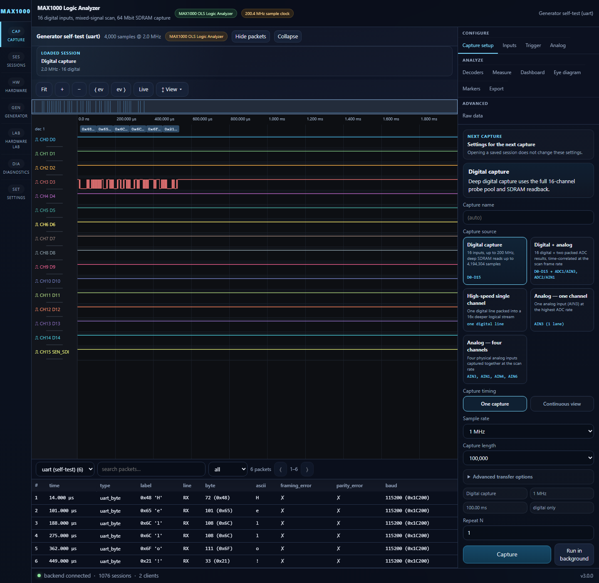
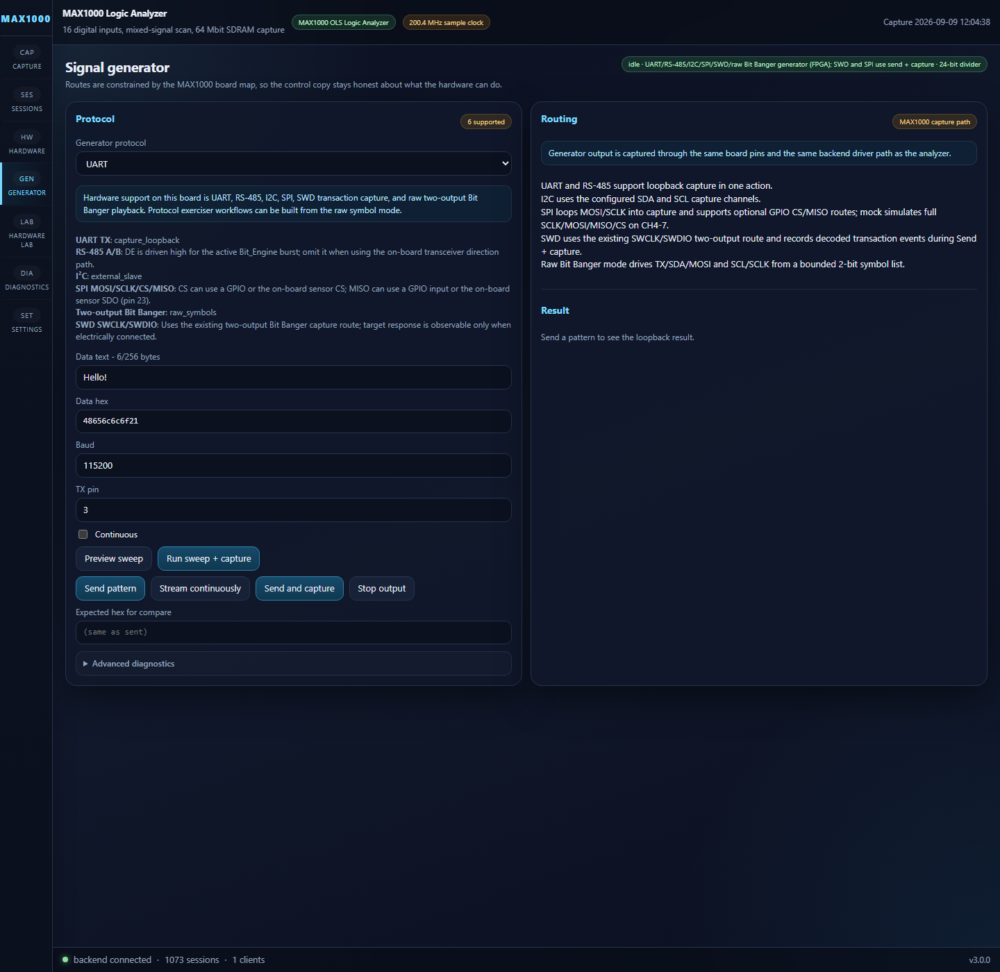
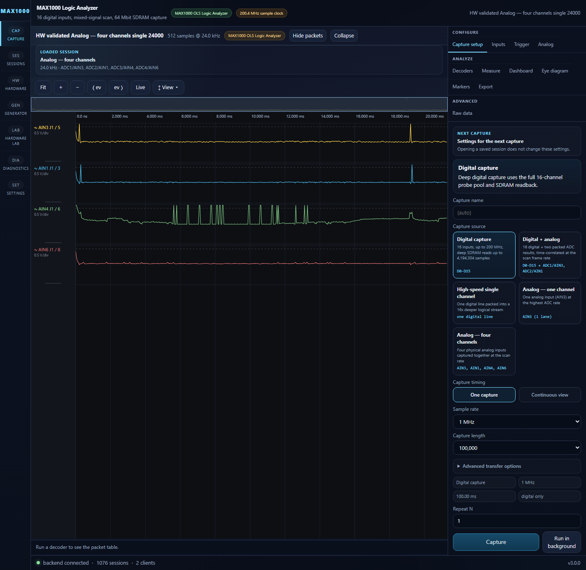

# OLS Logic Analyzer for MAX1000

OLS is a mixed-signal logic analyzer, capture backend, and signal-generator
stack for the Arrow MAX1000 board built around the Intel MAX 10 10M08. The
current repository includes:

- FPGA RTL for 200 MHz digital capture with SDRAM-backed deep storage
- The original Python host driver and tkinter tooling in [`host/`](host/)
- A FastAPI backend plus React frontend for browser-based capture and analysis
- Hardware validation, smoke tests, and regression tests for host, backend, and UI

The checked-in image and host stack are validated against the current MAX1000
bitstream behavior, including the narrower current analog feature set.

## Current Status

This repository is currently verified for:

- 16-channel digital capture up to the full 200.4 MHz sample clock
- Deep SDRAM single-shot capture up to `4,194,304` 16-bit words
- Packed narrow digital capture at 200 MHz for one selected channel
- Mixed capture with 16 digital bits plus the reduced two-result ADC frame
- Analog-fast capture of 1 ADC lane
- Maximum-analog capture of 4 physical analog inputs
- UART, RS-485, I2C, SPI, SWD transaction capture, and raw two-output Bit Banger generation
- Browser UI, backend API, and classic host-driver workflow

Latest validation baseline (software and hardware rerun 2026-09-09):

- `backend/app/tests`: `541/541` passed at 100% statement/branch coverage
- `host/tests/` + `host/driver/tests/`: `983/983` passed at 100% statement/branch coverage
- `frontend`: `277/277` passed at 100% statement/branch/function/line coverage; production build passed
- Full connected-fixture hardware regression: **403/403 passed, 0 failed, 0 skipped**
- Native GHDL regression: **57/57 passed**, with zero XFAIL/XPASS/exclusions
- Real-browser hardware validation: **5/5 feature tests** (including all 37 advertised mode/rate combinations) and **34/34 hardware-aligned UI tests**

## What The Current Bitstream Actually Does

### Digital

- 16 digital inputs from a programmable pin pool
- 200.4 MHz sample clock in the validated FAST build
- 1024-word BRAM fast path for small captures
- 64 Mbit SDRAM deep capture path for large single-shot and bounded live workflows
- Narrow packed mode stores 16 time samples for one selected channel in each 16-bit word

### Analog and Mixed

The current hardware exposes two analog capture profiles plus the mixed scan.

- `analog_fast`: 1 ADC lane, currently `ADC1 -> AIN3`
- `analog_all` / "Maximum analog": `ADC1,2,3,4 -> AIN3, AIN1, AIN4, AIN6`
- `mixed`: 16 digital bits plus physical ADC1/ADC2 results (`a1`/`a2`, AIN3/AIN1) in one time-correlated frame

On MAX1000, the current mixed wire format is the reduced two-result path. The
maximum-analog profile is the separate four-input physical scan over `AIN3`,
`AIN1`, `AIN4`, and `AIN6`.

### Readback Compression

Digital readback supports:

- `raw`
- `delta_rle` packed-delta-plus-RLE and direct `rle` in the host/UI surface

For the currently validated hardware block-read path, compressed capture blocks
decode from exact RLE block payloads with zero raw-retry fallback on the tested
board. On a recent hardware check with a compressible digital waveform, the
compressed block-read path delivered about `1.81x` faster readback than raw.

Analog and mixed captures use raw readback.

## Clock and Memory Summary

The validated FAST build uses one PLL with these main domains:

| Output | Frequency | Purpose |
| --- | --- | --- |
| `c0 -> sys_clk` | 100.2 MHz | SPI packet protocol, generator, UI-facing control logic |
| `c1 -> fast_clk` | 200.4 MHz | Digital sample capture and packing |
| `c2 -> sdram_core_clk` | 167 MHz | SDRAM controller, write pump, readout |
| `c4 -> sdram_chip_clk` | 167 MHz, phase-shifted | Forwarded SDRAM device clock |

Main storage paths:

- `1,024`-word BRAM capture path
- `512`-word async FIFO between capture and SDRAM
- `4,194,304` 16-bit SDRAM words for deep capture / bounded ring workflows

## UI Screenshots

All screenshots below were regenerated on 2026-09-09 from the attached
MAX1000 and the current volatile seed-10 image. The browser tests require the
named session to be active and its waveform payload to finish loading before
writing each PNG.

### Device Overview


### Mixed-Signal Capture


This capture is deliberately signal-dense so the digital transitions and ADC
waveform remain legible when the README image is shown at its normal size.

### Live Generator Loopback



### On-board LIS3DH Capture


### Generator Controls



### Analog Fast Hardware Waveform (1 ADC lane)


*Current one-lane analog-fast acquisition on AIN3 (J1/5) at a measured
1.002 MS/s. The trace is the actual attached-board input, not synthetic data.*

### Maximum Analog Hardware Waveform (4 ADC lanes)



*AIN3, AIN1, AIN4, and AIN6 captured together at 24 kS/s per lane. The four
distinct traces include the attached fixture response and floating-input
activity present during the validation run.*


## Running It

### Browser App

Requirements: Python 3.10+, Node.js 18+, and, for real hardware, the FTDI
D2XX driver plus the Python `ftd2xx` package. From a fresh checkout:

```powershell
cd C:\path\to\OLS_Logic_Analyzer_Clean
python -m pip install -r backend\requirements.txt
cd frontend
npm install
npm run build
cd ..\backend
python run.py
```

Open `http://localhost:8000`. For frontend development with hot reload, leave
the backend running and use a second shell:

```powershell
cd frontend
npm run dev
```

The Vite server runs at `http://localhost:5173` and proxies API/WebSocket
traffic to the backend. For a no-hardware check, open **Device**, connect
**Mock MAX1000 Analyser**, then choose a demo on **Capture**.

For the attached MAX1000, install the FTDI D2XX driver, connect the board, and
select **MAX1000 OLS Logic Analyzer** → **Connect**. Verify the complete device
path with:

```powershell
python backend\hw_smoke_test.py
```

### Windows packaged app

To build the portable Windows executable, use a Windows PowerShell prompt from
the repository root:

```powershell
python -m pip install -r desktop\requirements-build.txt
.\desktop\build-windows.ps1
```

The output is placed under `desktop\dist\`. Opening the `.exe` starts both the
backend and the frontend; users do not need to run two terminals. Real hardware
still requires the FTDI D2XX driver. See [WEBAPP.md](WEBAPP.md) and
[desktop/README.md](desktop/README.md) for build options and troubleshooting.

### Classic Host App

The original host tools remain under [`host/`](host/). See
[host/README.md](host/README.md).

## Validation Commands

### Backend and Host Tests

```powershell
$env:PYTHONPATH='backend'
python -m pytest backend/app/tests/test_existing_host_adapter.py

$env:PYTHONPATH='host'
python -m pytest host/driver/tests/test_ols_spi_device.py host/driver/tests/test_ols_spi.py
```

### Frontend Checks

```powershell
npm --prefix frontend run typecheck
npm --prefix frontend run build
$env:PLAYWRIGHT_USE_MOCK='1'
npm --prefix frontend run test:e2e -- hardware.spec.ts
```

### Hardware Smoke Test

```powershell
python backend/hw_smoke_test.py
```

### Full Hardware Validation

```powershell
cd host
python -m app.hw_validation
```

## Rebuilding The FPGA Image
The validated full-feature speed build uses Quartus seed `10`; use the current
project scripts and timing reports in [`hdl/proj/`](hdl/proj/). The current
validation image was loaded into volatile SRAM; persistent CFM was deliberately
left at the 2026-08-27 baseline.

```powershell
cd hdl\proj
.\compile.ps1 -Seed 10
```

For more detail, see:

- [hdl/README.md](hdl/README.md)
- [TIMING_REPORT_SUMMARY.md](TIMING_REPORT_SUMMARY.md)
- [WEBAPP.md](WEBAPP.md)

## Repository Layout

- `backend/` - FastAPI backend, hardware adapter, session store, API tests
- `frontend/` - React UI, waveform viewer, Playwright E2E tests
- `hdl/` - RTL, Quartus project, constraints, simulation
- `host/` - Python SPI driver, tkinter app, classic validation tooling
- `docs/` - design notes and mode-planning documents

## License

MIT
