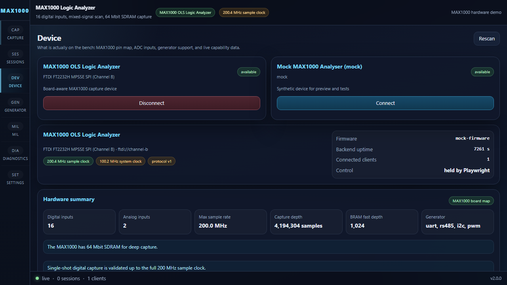
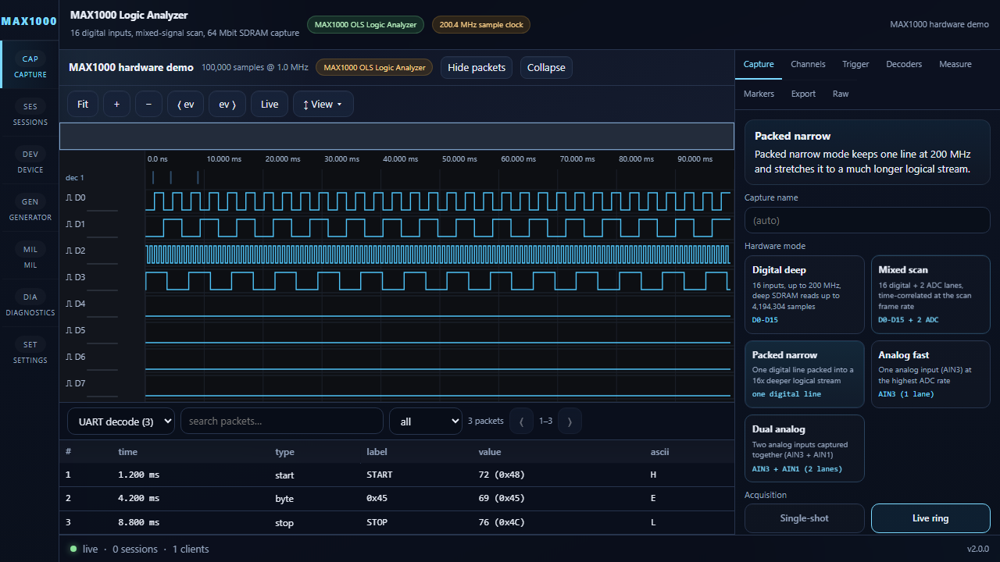
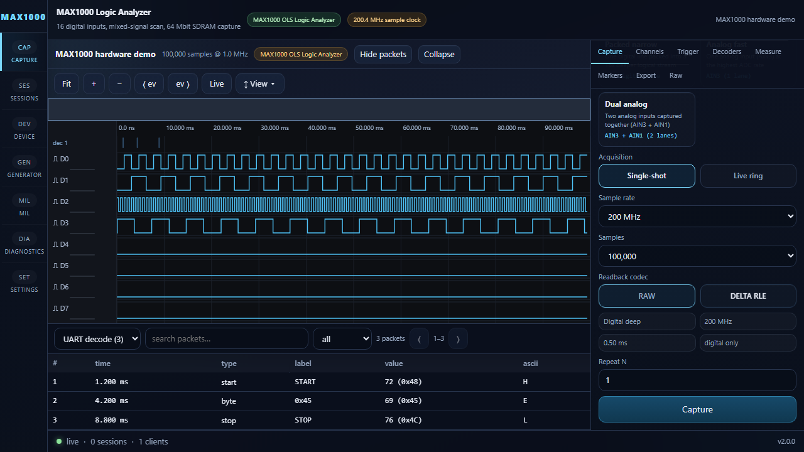
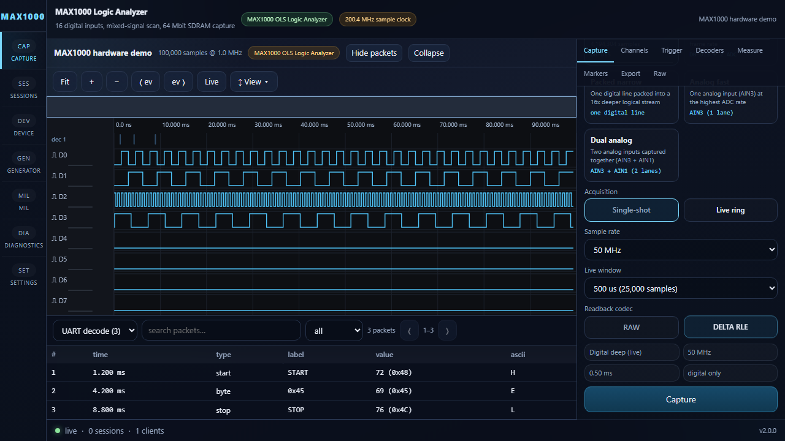
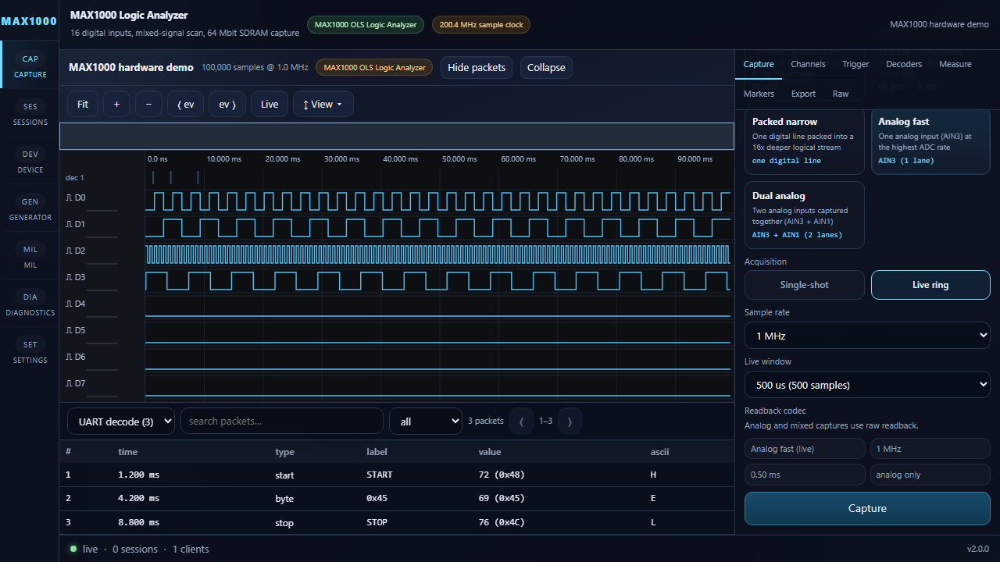
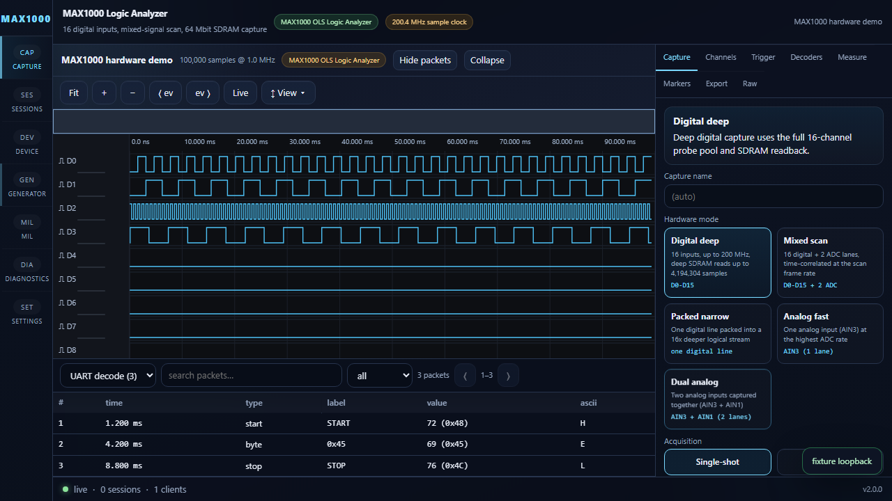
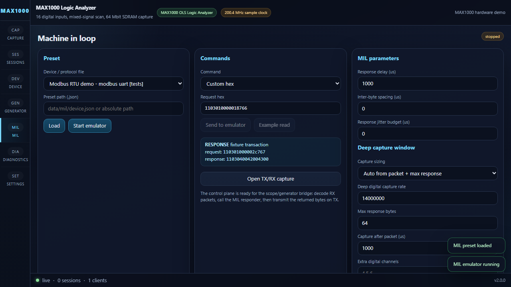
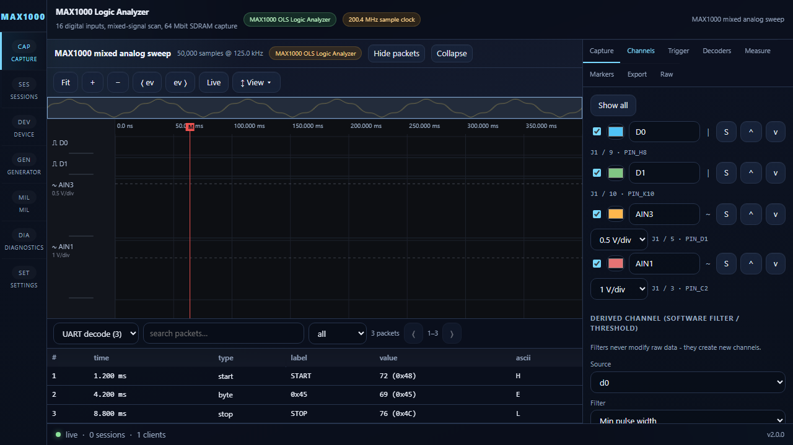

# OLS Logic Analyzer for MAX1000

OLS is a mixed-signal logic analyzer, capture backend, and signal-generator
stack for the Arrow MAX1000 board built around the Intel MAX 10 10M08. The
current repository includes:

- FPGA RTL for 200 MHz digital capture with SDRAM-backed deep storage
- The original Python host driver and tkinter tooling in [`host/`](host/)
- A FastAPI backend plus React frontend for browser-based capture and analysis
- Hardware validation, smoke tests, and regression tests for host, backend, and UI

The checked-in image and host stack are validated against the current MAX1000
bitstream behavior, including the narrower current analog feature set.

## Current Status

This repository is currently verified for:

- 16-channel digital capture up to the full 200.4 MHz sample clock
- Deep SDRAM single-shot capture up to `4,194,304` 16-bit words
- Packed narrow digital capture at 200 MHz for one selected channel
- Mixed capture with 16 digital bits plus 2 ADC lanes
- Analog-fast capture of 1 ADC lane
- Dual-analog capture of 2 ADC lanes
- UART, RS-485, I2C, and PWM generation
- Browser UI, backend API, and classic host-driver workflow

Recently re-verified before this README update:

- `backend/app/tests/test_existing_host_adapter.py`: `19/19` passed
- `host/driver/tests/test_ols_spi_device.py` + `test_ols_spi.py`: `194/194` passed
- `frontend` typecheck and production build: passed
- `frontend/tests/e2e/hardware.spec.ts` in mock mode: `8 passed, 2 skipped`
- `backend/hw_smoke_test.py`: `7/7` passed on hardware
- Focused hardware checks for digital compression, analog-fast, dual-analog, and mixed capture: passed

## What The Current Bitstream Actually Does

### Digital

- 16 digital inputs from a programmable pin pool
- 200.4 MHz sample clock in the validated FAST build
- 1024-word BRAM fast path for small captures
- 64 Mbit SDRAM deep capture path for large single-shot and bounded live workflows
- Narrow packed mode stores 16 time samples for one selected channel in each 16-bit word

### Analog and Mixed

The current hardware does **not** stream all board analog inputs at once.

- `analog_fast`: 1 ADC lane, currently `ADC1 -> AIN3`
- `analog_all` / "Dual analog": 2 ADC lanes, currently `ADC1 + ADC2 -> AIN3 + AIN1`
- `mixed`: 16 digital bits plus 2 ADC lanes in one time-correlated frame

Board analog inputs such as `AIN0`, `AIN5`, `AIN7`, and dedicated `AIN/ADC16`
exist physically on the MAX1000, but the current capture RTL does not stream
them all simultaneously.

### Readback Compression

Digital readback supports:

- `raw`
- `delta_rle` in the host/UI surface

For the currently validated hardware block-read path, compressed capture blocks
decode from exact RLE block payloads with zero raw-retry fallback on the tested
board. On a recent hardware check with a compressible digital waveform, the
compressed block-read path delivered about `1.81x` faster readback than raw.

Analog and mixed captures use raw readback.

## Clock and Memory Summary

The validated FAST build uses one PLL with these main domains:

| Output | Frequency | Purpose |
| --- | --- | --- |
| `c0 -> sys_clk` | 100.2 MHz | SPI packet protocol, generator, UI-facing control logic |
| `c1 -> fast_clk` | 200.4 MHz | Digital sample capture and packing |
| `c2 -> sdram_core_clk` | 167 MHz | SDRAM controller, write pump, readout |
| `c4 -> sdram_chip_clk` | 167 MHz, phase-shifted | Forwarded SDRAM device clock |

Main storage paths:

- `1,024`-word BRAM capture path
- `4,096`-word async FIFO between capture and SDRAM
- `4,194,304` 16-bit SDRAM words for deep capture / bounded ring workflows

## UI Screenshots

### Device Overview



### Capture Mode Controls



### Delta-RLE Digital Readback Selection



### Live 50 MHz Digital Workflow



### Analog-Fast Mode



### Generator Loopback Capture



### MIL / Bit-Banger Loopback



### Mixed Analog Session



## Running It

### Browser App

See [WEBAPP.md](WEBAPP.md) for the full browser-hosted stack. The usual entry
point is:

```powershell
cd backend
python run.py
```

Then start the frontend in another shell:

```powershell
cd frontend
npm install
npm run dev
```

### Classic Host App

The original host tools remain under [`host/`](host/). See
[host/README.md](host/README.md).

## Validation Commands

### Backend and Host Tests

```powershell
$env:PYTHONPATH='backend'
python -m pytest backend/app/tests/test_existing_host_adapter.py

$env:PYTHONPATH='host'
python -m pytest host/driver/tests/test_ols_spi_device.py host/driver/tests/test_ols_spi.py
```

### Frontend Checks

```powershell
npm --prefix frontend run typecheck
npm --prefix frontend run build
$env:PLAYWRIGHT_USE_MOCK='1'
npm --prefix frontend run test:e2e -- hardware.spec.ts
```

### Hardware Smoke Test

```powershell
python backend/hw_smoke_test.py
```

### Full Hardware Validation

```powershell
cd host
python -m app.hw_validation
```

## Rebuilding The FPGA Image

The checked-in speed build has been tracked around Quartus seed `33`, but use
the current project scripts and timing reports in [`hdl/proj/`](hdl/proj/).

```powershell
cd hdl\proj
.\compile.ps1 -Seed 33
```

For more detail, see:

- [hdl/README.md](hdl/README.md)
- [TIMING_REPORT_SUMMARY.md](TIMING_REPORT_SUMMARY.md)
- [WEBAPP.md](WEBAPP.md)

## Repository Layout

- `backend/` - FastAPI backend, hardware adapter, session store, API tests
- `frontend/` - React UI, waveform viewer, Playwright E2E tests
- `hdl/` - RTL, Quartus project, constraints, simulation
- `host/` - Python SPI driver, tkinter app, classic validation tooling
- `docs/` - design notes and mode-planning documents

## License

MIT
