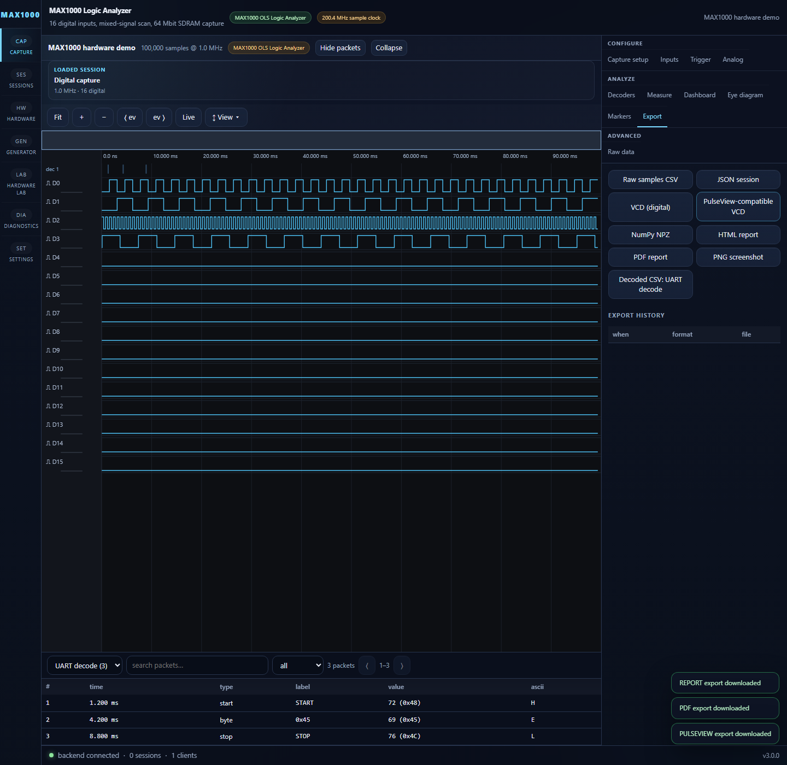

# Export and Import Formats

**Directory:** `backend/app/exports/`

Exports are generated from immutable session metadata, waveform arrays, and
completed decoder-event files. Each successful export appends an
`ExportRecord` to the session.

## Export formats

| Format | Endpoint | Implementation | Notes |
|---|---|---|---|
| CSV | `POST /api/sessions/{id}/export/csv` | `csv_export.py` | Streams sample rows; supports window/channel selection or decoder-event CSV |
| JSON | `POST /api/sessions/{id}/export/json` | `json_export.py` | Round-trippable MSA JSON; raw arrays optional |
| VCD | `POST /api/sessions/{id}/export/vcd` | `vcd_export.py` | Streams digital value changes for HDL/sigrok tools |
| PulseView | `POST /api/sessions/{id}/export/pulseview` | `vcd_export.py` | VCD with a PulseView-friendly filename; not a native `.sr` container |
| NPZ | `POST /api/sessions/{id}/export/npz` | `npz_export.py` | NumPy waveform archive plus metadata |
| HTML report | `POST /api/sessions/{id}/export/report` | `report_export.py` | Self-contained metadata, waveform summary, decoder, measurement, marker, and diagnostic report |
| PDF report | `POST /api/sessions/{id}/export/pdf` | `pdf_export.py` | Dependency-free, multi-page text report |

### Request options

- CSV accepts `start`, `end`, `channels`, and optional `decoder_instance`.
- JSON accepts `include_raw` (default `true`).
- VCD and PulseView-VCD accept a digital channel list.
- NPZ, HTML, and PDF currently export the complete session.

All responses use `Content-Disposition` filenames derived from the sanitized
session name. CSV and VCD use iterators so large exports do not first build one
giant response string in memory.

## Format details

### CSV

Sample CSV contains `sample`, `time_s`, one 0/1 column per selected digital
channel, and voltage columns for selected analog channels. Decoder CSV instead
serializes saved event rows for one decoder instance.

### JSON

The MSA JSON envelope contains the `Session` model, optional raw waveform
arrays, and completed decoder events. It can be imported through
`POST /api/sessions` with a `json_text` body.

### VCD and PulseView

VCD includes digital channels only. The PulseView endpoint intentionally uses
the same stable VCD writer because native sigrok `.sr` files are versioned
binary containers and this project does not claim a native writer.

### NPZ

The archive stores packed digital words, per-channel analog arrays, and JSON
metadata for NumPy-based analysis. This download format is separate from the
backend's live session persistence policy.

### Reports

The HTML report is the rich browser-viewable artifact. The PDF writer is a
small built-in PDF 1.4 generator that produces portable text pages without a
browser or third-party renderer.

## Waveform imports

`importers.py` converts external waveform text into ordinary sessions:

| Source | API | Behavior |
|---|---|---|
| JSON | `POST /api/sessions` with `json_text` | Restores an exported MSA session |
| CSV | `POST /api/sessions` with `source_text`, `source_format: "csv"`, and `sample_rate` | Reads digital 0/1 and ` (V)` analog columns |
| VCD | Same endpoint with `source_format: "vcd"` | Imports one-bit wire variables using the VCD timescale |

Imported sessions use the same decoders, measurements, trigger search,
comparison, waveform analysis, and export paths as hardware captures.

## Evidence

Backend tests cover format generation, request validation, round trips, and
edge cases. Playwright covers the browser export controls, including HTML,
PDF, and PulseView-VCD downloads.

Related subsystems have their own pages:
[Generator Controller](generator-controller.md),
[Machine-In-Loop](machine-in-loop.md), and
[WebSocket & Diagnostics](websocket-diagnostics.md).
