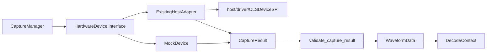

# Hardware and Capture Seam

This page documents the seam between device-specific acquisition and the rest
of the backend. The goal is a deep `HardwareDevice` module: callers learn a
small interface while capture modes, wire formats, retries, and hardware
quirks remain inside an adapter.

## Flow

## Interface contract

`HardwareDevice` owns connection lifecycle, capabilities, capture, and
diagnostics. `CaptureManager` must not know whether data came from FTDI, a
mock, or a future adapter.

Every `capture()` or `stream_capture()` result must satisfy these invariants:

- `sample_rate` is finite and positive.
- At least one one-dimensional sample array is present.
- Packed digital samples are integer words in the `uint16` range.
- Every digital and analog channel has the same sample count.
- `trigger_sample`, when present, lies within the capture.
- The clock divider, when present, is non-negative.

`validate_capture_result()` enforces these invariants immediately after the
adapter returns. This keeps malformed payloads out of session storage,
WebSocket notifications, and decoders.

## Adapters and testing

`ExistingHostAdapter` is the production adapter for the legacy
`OLSDeviceSPI` implementation. `MockDevice` is the in-process adapter used by
backend and browser tests. The real adapter also accepts an injected driver
loader, so its lifecycle can be tested without importing FTDI libraries or
mutating private device state.

The capture strategies under `app/hardware/strategies/` are internal seams of
the real adapter. They translate digital, narrow-digital, analog, analog-all,
and mixed wire formats into the same `CaptureResult` interface.

## Shared data contracts

- `CaptureSettings` describes what the user requested.
- `CaptureResult` describes what the hardware produced.
- `WaveformData` is the canonical in-memory waveform used by storage and
  decoders.
- `DecodeContext` gives a decoder a bounded waveform region, channel mapping,
  cancellation, progress, and stacked-decoder events.

Changes to these types should be accompanied by contract tests and checked
against the frontend API types and HDL/host wire-format assumptions.

## Change checklist

1. Change the adapter or strategy, not `CaptureManager`, for device-specific
   behaviour.
2. Return a normalized `CaptureResult`; do not leak raw wire bytes upward.
3. Add a contract test for digital, analog, mixed, and streaming paths as
   applicable.
4. Update the frontend/API or HDL documentation when a field or unit changes.
5. Run hardware validation after RTL or wire-format changes; the graph is a
   map of relationships, not a substitute for board evidence.
