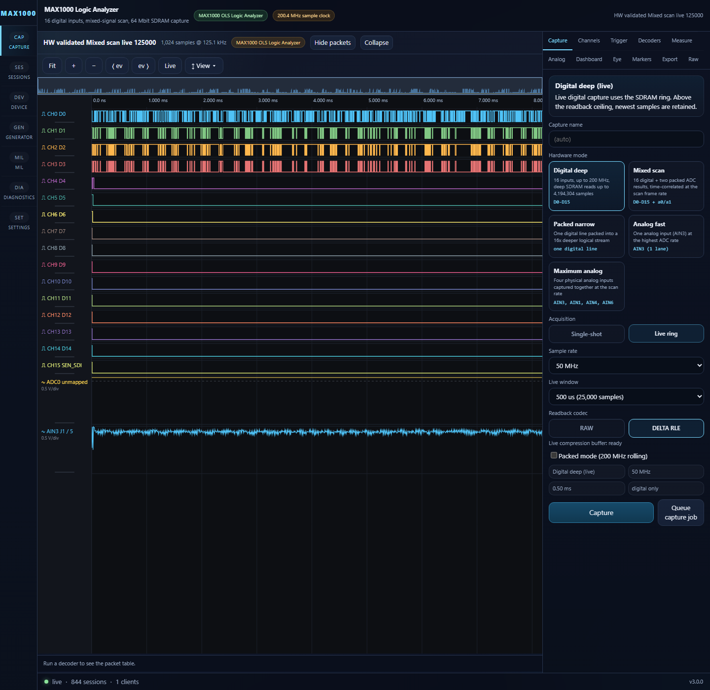
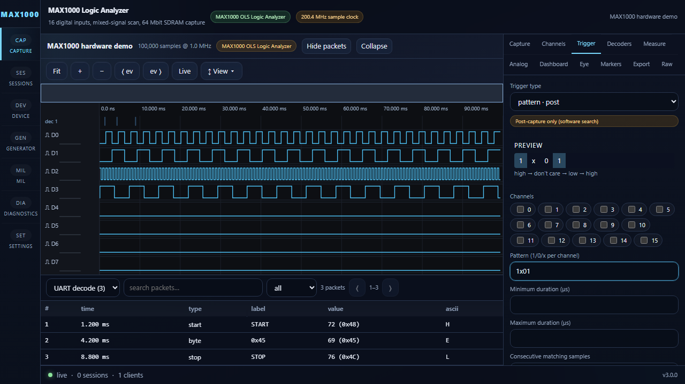
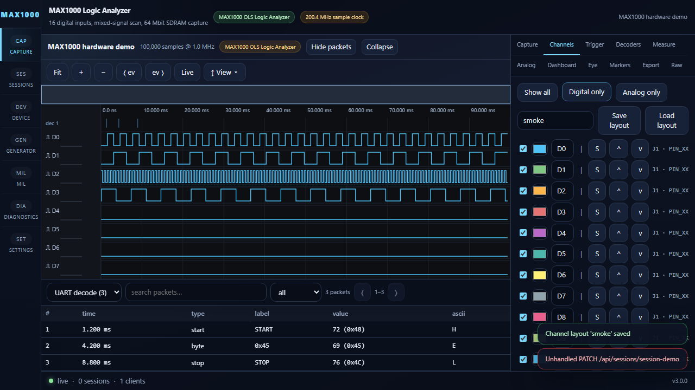
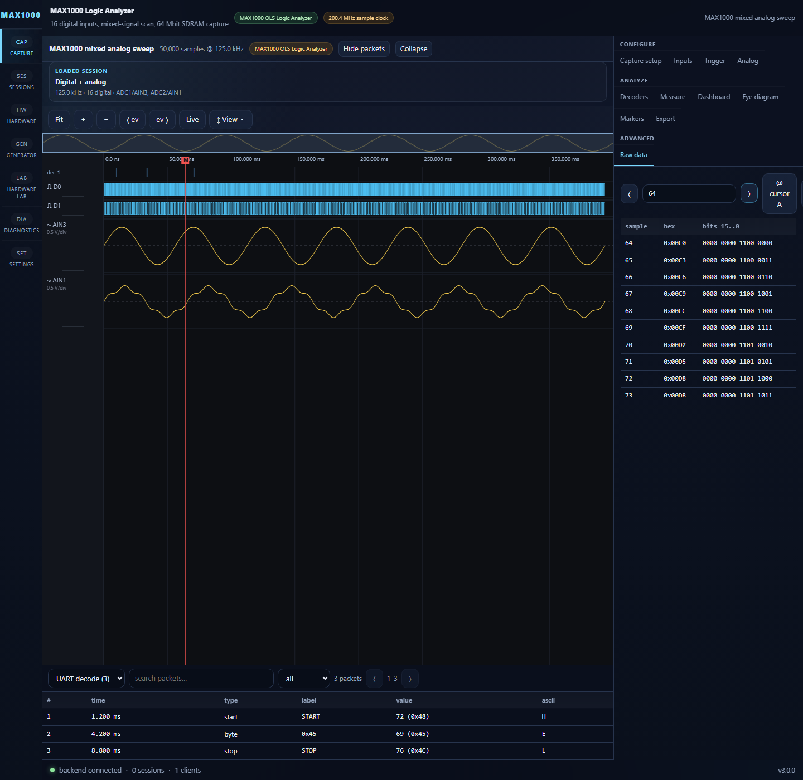

# Capture Controls

**File:** `frontend/src/panels/CaptureControls.tsx`

## Purpose

Primary capture configuration panel: source, acquisition mode, sample rate, depth, compression.

## Mode Architecture

```typescript
type CaptureSource = 'digital' | 'mixed' | 'digital_narrow' | 'analog_fast' | 'analog_all';
type Acquisition = 'single' | 'live';
```

## Source Options

| Source | Modes | Max Rate | Notes |
|---|---|---|---|
| Digital (16ch) | single, live | 200 MHz / 50 MHz live | Full 16-channel |
| Mixed (16+analog) | single, live | 125 kframes/s | 16 digital + two ADC lanes (`a0`/`a1`) |
| Digital Narrow | live only | 200.4 MHz | One line, up to 16× SDRAM logical depth |
| Analog Fast | single, live | 1 MHz | `AIN3`, one ADC lane |
| Maximum Analog | single, live | 24 kS/s/lane | Four physical lanes: `AIN3`, `AIN1`, `AIN4`, `AIN6` |

## Rate Options

| Mode | Available Rates |
|---|---|
| Digital | 10k–200 MHz (14 steps) |
| Live Rolling | 10k–50 MHz (filtered) |
| Mixed | 125 kHz only |
| Analog Fast | 100k–1 MHz (4 steps) |
| Maximum Analog | 24 kHz only |

## Depth Options

| Mode | Depths |
|---|---|
| Digital | 1024, 10K, 50K, 100K, 250K, 500K, 1M, 2M, 4,194,304 |
| Analog Fast/Mixed | 1024, 10K, 50K, 100K, 250K |
| Maximum Analog | 1024, 10K, 50K, 100K |

## Live Rolling Window

100 µs, 500 µs, 1 ms, 5 ms, 10 ms, 50 ms, 100 ms, 500 ms, 1 s,
and 5 s, filtered when the resulting sample count exceeds the selected mode's
logical depth.

## Compression

Digital modes: raw, direct `rle`, or packed-delta-plus-RLE `delta_rle`.
`delta` remains a spelling for `delta_rle`. Mixed/analog: raw only.

## State

Connected to `useApp().captureSettings` with `setCaptureSettings()` partial updates.

## Playwright captures










