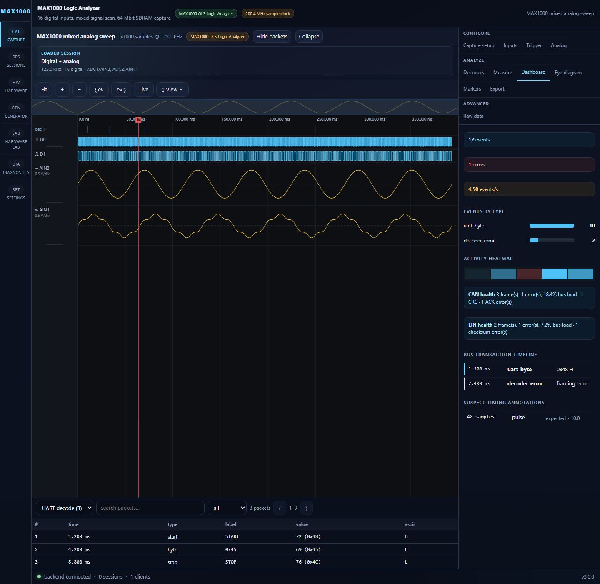
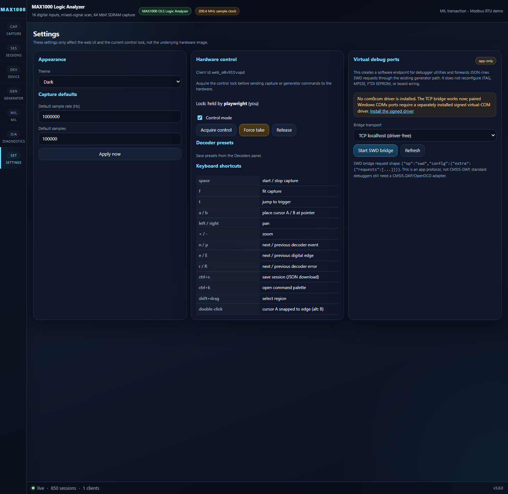
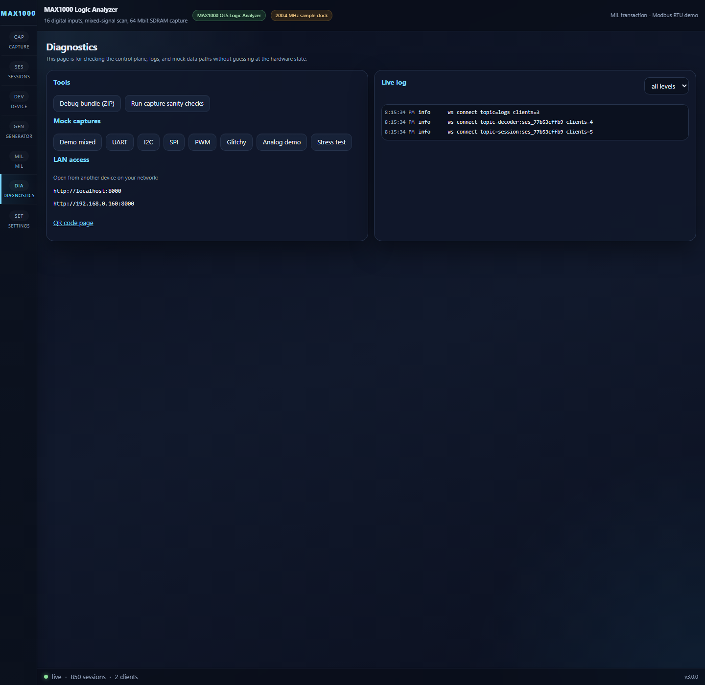

# Pages

**Directory:** `frontend/src/pages/`

## Purpose

Top-level page components rendered by `AppShell` based on navigation selection.

## CapturePage (`CapturePage.tsx`)

Main capture view: waveform centre, collapsible side panel with 11 tabs, packet
table at bottom.

```
┌─────────────┬──────────────────────────────┐
│ Side Panel  │  Waveform Canvas             │
│ (tabs)      │                              │
│ Capture     │                              │
│ Channels    │                              │
│ Trigger     │                              │
│ Decoders    │                              │
│ Measure     │                              │
│ Analog      │                              │
│ Markers     │                              │
│ Export      │                              │
│ Raw         │                              │
│ Dashboard   │                              │
│ Eye         │                              │
├─────────────┴──────────────────────────────┤
│  Packet Table (decoder events)             │
└────────────────────────────────────────────┘
```

Key behaviour: auto-loads most recent session on mount, opens new session on capture complete.

## SessionsPage (`SessionsPage.tsx`)

Lists saved sessions in searchable, 100-row pages. Supports open, delete,
duplicate, JSON/CSV/VCD import, and two-session comparison/alignment.

## DevicePage (`DevicePage.tsx`)

Device discovery, connect/disconnect, hardware overview:
- Key facts table (clock, SDRAM depth, ADC specs)
- Digital pin map (pool index → board label → FPGA pin)
- Analog input table
- Raw debug inspector (registers, metadata)
- Self-test runner

## GeneratorPage (`GeneratorPage.tsx`)

Capability-driven protocol, payload, timing, and pin controls; Bit Banger
scripts/presets; exact rate preview; parameter sweeps; one-shot, live-repeat,
loopback capture, stop, and self-test actions.

## MachineInLoopPage (`MachineInLoopPage.tsx`)

MIL automation: preset select, protocol config, run/abort, transaction results.

## DiagnosticsPage (`DiagnosticsPage.tsx`)

Log viewer, debug bundle download, self-test, mock capture with scenario selector.

## SettingsPage (`SettingsPage.tsx`)

Theme, capture defaults, control-lock acquire/force/release, decoder presets,
keyboard shortcuts, and virtual COM/SWD bridge controls.

## UI feature gallery

These Playwright captures show the main application surfaces in mock mode:







