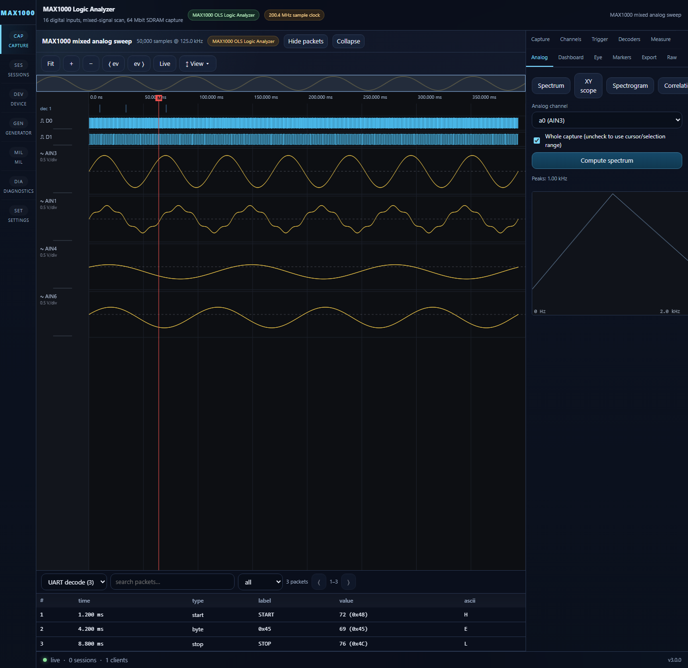

# Capture Side Panels

**Directory:** `frontend/src/panels/`

The Capture page exposes 11 tabs:

| Panel | Purpose |
|---|---|
| `CaptureControls` | Source/acquisition/rate/depth/compression, validation findings, capture jobs |
| `ChannelPanel` | Visibility, names/colors, row height, physical mapping, buses |
| `TriggerPanel` | Hardware/post-capture trigger builder, search, auto-scope, navigation |
| `DecoderPanel` | Add/configure/run/cancel/remove decoders; quality and event counts |
| `MeasurementPanel` | Create scoped measurements and compute cursor results |
| `AnalogPanel` | Spectrum, spectrogram, correlation, envelope, threshold, event-correlation analysis |
| `MarkerPanel` | Named markers/cursors, notes, colors, time/sample deltas |
| `ExportPanel` | CSV, JSON, VCD, PulseView-VCD, NPZ, HTML, and PDF downloads |
| `RawInspector` | Bounded raw sample/value/hex inspection |
| `DashboardPanel` | Protocol activity, event/error density, and decoder summaries |
| `EyePanel` | Folded eye diagram and timing-suspect analysis |

Panels store small configuration/metadata in Zustand and leave waveform arrays
in the shared `WaveformView`. Actions that mutate hardware honor the current
control lock; analysis and navigation remain available in read-only mode.

Representative screenshots:

