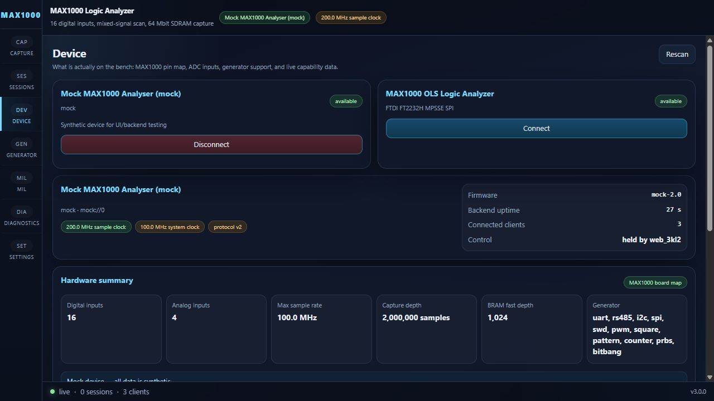
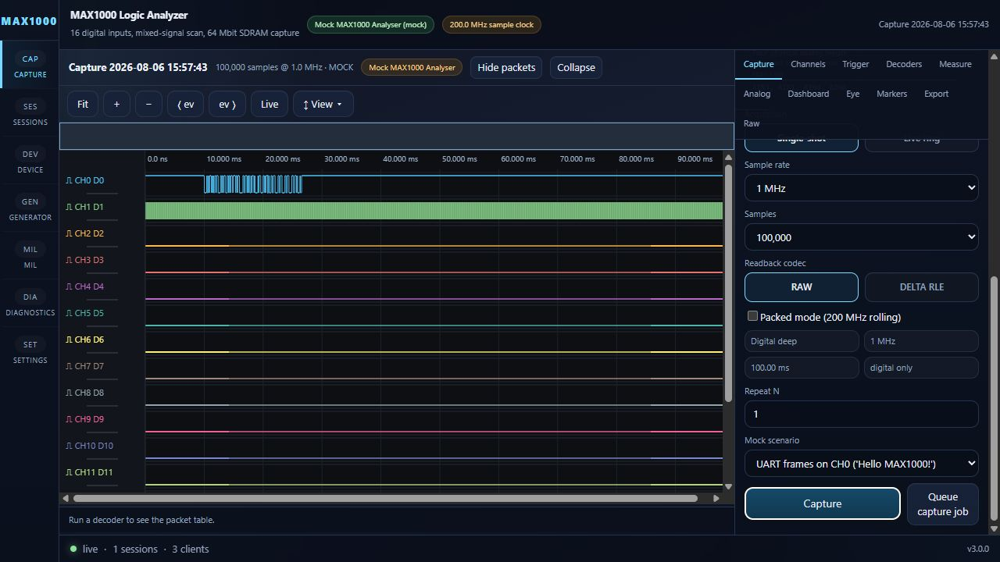
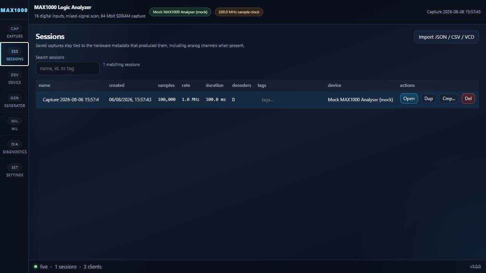
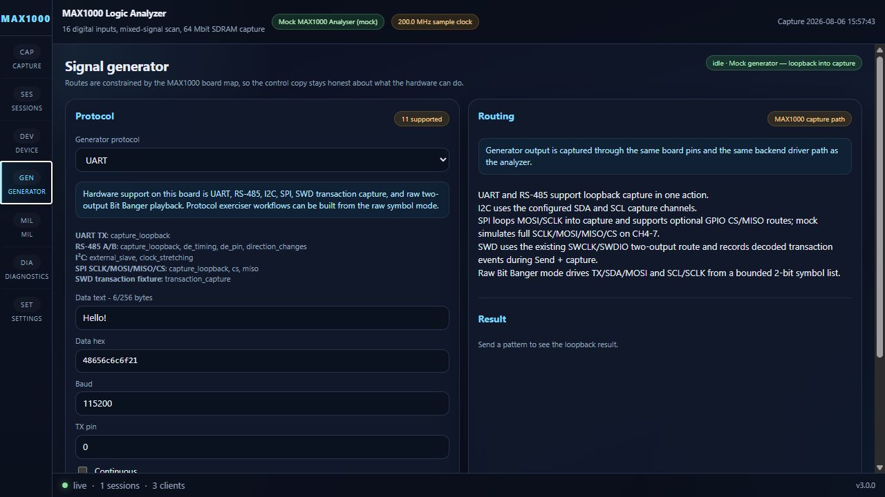

# OLS Logic Analyzer — User Guide

This page is a visual tour of the React/FastAPI application. The screenshots
below were captured on 2026-08-06 using the built-in Mock MAX1000 Analyser, so
they show the complete UI without requiring a board to be connected.

## Start here

For Windows users, open the portable executable produced by the packaging
workflow. It starts the frontend and backend together:

- [Windows desktop package](../../../desktop/README.md)
- [Windows packaging script](../../../desktop/build-windows.ps1)

For development, build the frontend once and start the backend from the
repository root:

```powershell
cd frontend
npm run build
cd ../backend
python run.py
```

Open `http://localhost:8000`. The backend serves the built frontend and owns
the hardware connection, sessions, decoders, exports, and WebSocket updates.

## First run: connect a device

Open **Device** from the left navigation. The page shows the detected devices,
the board capability summary, the digital pin pool, analogue inputs, and the
capture/trigger matrix.



Choose **Mock MAX1000 Analyser** when exploring the UI or running a demo. It
generates deterministic synthetic captures and exercises the same frontend and
backend paths as real hardware. Choose **MAX1000 OLS Logic Analyzer** when the
board and FTDI driver are connected.

The top status bar reports the active device, sample clock, capture state, and
current session. The bottom bar reports connection state, session count, and
connected clients.

## Capture and inspect a waveform

Open **Capture**, choose a hardware mode, sample rate, sample count, and
acquisition type. In mock mode, the **Mock scenario** selector provides UART,
I²C, SPI, RS-485, PWM, analogue, Manchester, SWD, and fault scenarios.



Press **Capture** to create a session. The waveform viewer supports:

- fit, zoom, horizontal pan, and live view controls;
- channel visibility and ordering through **Channels**;
- hardware/software trigger configuration through **Trigger**;
- decoder configuration and packet annotations through **Decoders**;
- measurements, analogue analysis, eye diagrams, markers, exports, and raw
  inspection through the remaining side-panel tabs.

The large waveform stays in the viewer store rather than React component state,
so the UI can inspect deep captures without copying the full sample buffer
through the component tree.

## Save and reopen captures

Every completed capture is stored as a session. Open **Sessions** to search,
open, duplicate, compare, delete, or import sessions.



Sessions retain device metadata, capture settings, channel metadata, trigger
configuration, decoder results, measurements, markers, diagnostics, and the
immutable waveform. Export formats include CSV, JSON, VCD, NPZ, and HTML
reports.

## Generate protocol traffic

Open **Generator** to exercise a protocol route and optionally capture the
result through the same analyser path. The page is capability-driven: it
shows UART, RS-485, I²C, SPI, SWD, PWM, pattern, counter, PRBS, and Bit Banger
options according to the connected device.



For a loopback check, select a protocol, enter the data and route pins, then
use **Send + capture** or **Run generator self-test**. The self-test stores the
capture as a normal session and compares decoded bytes or transactions with
the expected result.

## Other pages

| Page | Purpose |
|---|---|
| **MIL** | Run the machine-in-loop protocol emulator and optionally save evidence captures |
| **Diagnostics** | Inspect backend logs, device state, debug information, and self-tests |
| **Settings** | Manage control lock, virtual serial bridge, layouts, and app preferences |

## Hardware versus mock mode

Mock mode is intended for UI exploration, automated tests, and protocol
workflow development. It does not validate electrical timing or the FTDI/FPGA
transport. Real hardware mode requires:

1. the MAX1000 connected over FTDI;
2. the Windows FTDI D2XX driver installed;
3. the `ftd2xx` Python wrapper included in the packaged build or installed in a
   development environment.

The UI exposes the device capability contract rather than pretending that a
route is available. Hardware-limited features remain labelled as such in the
Device, Capture, and Generator pages.
