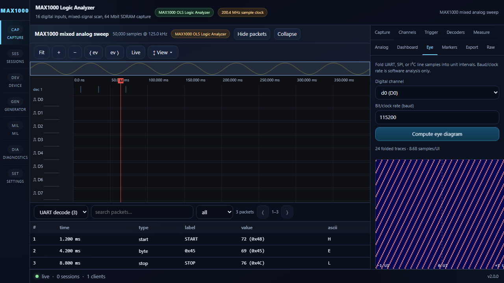
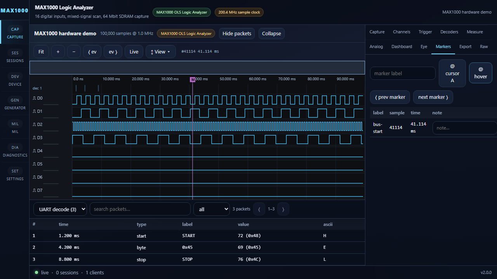
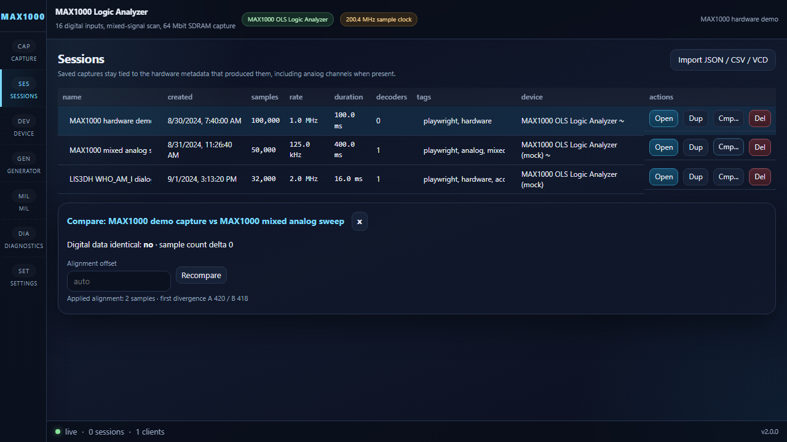
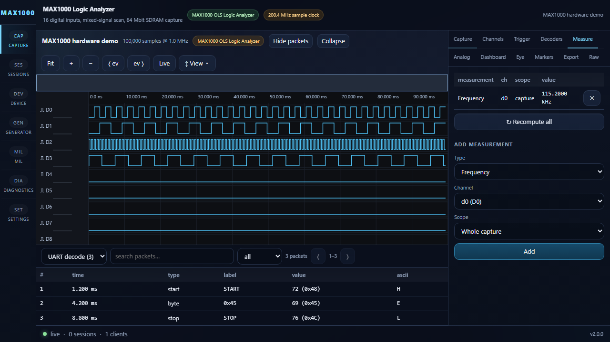

# Waveform Viewer

**File:** `frontend/src/waveform/WaveformCanvas.tsx` (not enumerated — render logic is in canvas drawing code)

## Purpose

Canvas-based waveform rendering component. Displays digital and analog channels with zoom, pan, marker/cursor interaction, transition-density shading, and decoder annotation overlays.

## Rendering Architecture

```
WaveformView (state/data class)
    │
    ▼
WaveformCanvas (React component)
    │  reads data directly from WaveformView
    │  renders to <canvas> element
    │
    ├── drawDigitalChannel(channel, ctx, viewRect)
    │     ├── raw mode: draw each sample as high/low line
    │     └── LOD mode: transition-density blocks
    │           (and_bit=1 && or_bit=1) → solid high
    │           (and_bit=0 && or_bit=0) → solid low
    │           (and_bit=0 && or_bit=1) → density fill
    │
    ├── drawAnalogChannel(channel, ctx, viewRect)
    │     ├── raw mode: sample-to-sample line segments
    │     └── LOD mode: min/max fill
    │
    ├── drawDecoderAnnotations(ctx, events, viewRect)
    │     └── event markers with type colour, tooltip on hover
    │
    ├── drawMarkers(ctx, markers)
    │     └── vertical lines A/B with labels
    │
    └── drawGrid(ctx)
          └── time axis, channel dividers, cursor crosshairs
```

## Interaction

| Action | Effect |
|---|---|
| Scroll wheel | Zoom in/out at cursor position |
| Click + drag | Pan horizontally |
| Shift + drag | Select zoom region |
| Double-click | Place/remove marker |
| A/B keys | Toggle marker A/B at cursor |
| Hover over annotation | Show tooltip with event details |

## Performance

- Canvas (not SVG or DOM) — handles millions of samples
- LOD pyramid avoids drawing every sample when zoomed out
- Only visible window is rendered (clipped by viewport)
- TypedArray data accessed directly from `WaveformView`, no React overhead
- Transition-density shading: when zoomed out beyond per-sample resolution, areas with transitions are filled with density gradient

## Channel Colours

Each channel has an assigned colour (configurable in ChannelPanel):
- Digital: solid lines (green default)
- Analog: filled waveform (blue default)
- Decoder annotations: colour-coded by event type

## Dependencies

| Module | File |
|---|---|
| `WaveformView` | `state/waveformStore.ts` |
| `WaveformPayload` | `api/binary.ts` |
| `DecoderEvent`, `Marker` | `api/types.ts` |

## Playwright captures









