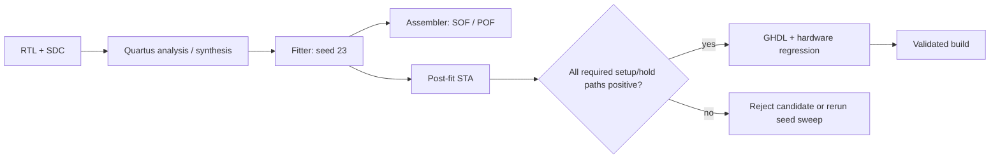

# Build Flow: Quartus Project

**Directory:** `hdl/proj/`

## Target Device

| Property | Value |
|---|---|
| FPGA | Intel MAX 10 10M08SAU169C8G |
| Family | MAX 10 |
| Package | 484-pin FBGA |
| Speed grade | C8 |
| Logic elements | 8,064 (7,875 / 98% used in current full build, 2026-07-22) |

## Project Files

| File | Purpose |
|---|---|
| `OLS_Logic_Analyzer.qsf` | Quartus Settings File — device, pin assignments, SDC, VHDL files |
| `OLS_Logic_Analyzer.qpf` | Quartus Project File |
| `OLS_Logic_Analyzer.sdc` | Synopsys Design Constraints — clock, I/O timing |
| `OLS_Logic_Analyzer_wrapper.vhd` | Generated wrapper (overwritten on compile) |
| `postfix_reports.tcl` | Post-fit timing report generation |
| `report_after_buf_logic.tcl` | Report after buffer logic synthesis stage |
| `report_after_analog_stage.tcl` | Report after analog synthesis stage |
| `report_clk1_paths.tcl` | Report all paths on clock domain 1 |

## Build Scripts

### compile.ps1

PowerShell build script (current parameters, verified against the script 2026-07-21):
```
.\compile.ps1 -Flash -Seed 23
```

Parameters:
- `-Seed` (default: 23): Quartus fitter seed for placement/routing; re-sweep after every RTL change
- `-NoFlash` (switch): compile only, skip JTAG programming
- `-Flash` (switch): program the board via JTAG after compiling
- `-RawOnly` (switch): build with `FAST_RAW_BUILD=true`, eliding the `mso_capture`/MSO bit-pack pipeline for extra timing margin (default is the full mixed-signal build with `mso_capture` included)
- `-LegacyClkForward` (switch): use the direct PLL c4 SDRAM clock forward instead of the default DDIO forward (see [`sdram-pll.md`](../hdl/sdram-pll.md))

Steps:
1. Generate top-level wrapper VHDL with generic parameters
2. Update QSF with current seed and options
3. Run `quartus_map` (analysis & elaboration)
4. Run `quartus_fit` (fitter with seed)
5. Run `quartus_asm` (assembler)
6. Run `quartus_sta` (timing analysis)
7. Run `quartus_eda` (netlist export)

### seed_sweep.ps1

Automated fitting with multiple seeds, stopping as soon as every tracked
clock closes with margin:
```
.\seed_sweep.ps1
```

Reports results to `seed_sweep_results.txt`. A seed is not considered validated
unless the corrected RTL and current constraints both close setup and hold.

## Timing Constraints (SDC)

| Constraint | Value | Domain |
|---|---|---|
| `create_clock` sys_clk | 100.2 MHz (period 9.98 ns) | c0 |
| `create_clock` fast_clk | 200.4 MHz (period 4.99 ns) | c1 |
| `create_clock` sdram_core_clk | 167 MHz (period 5.99 ns) | c2 |
| `create_clock` sdram_chip_clk | 167 MHz (period 5.99 ns) | c4 |
| `create_clock` adc_conv_clk | 12 MHz (period 83.33 ns) | c3 |
| SDRAM output delay | 2.0 ns | sdram_dq/dqm/addr/ba |
| SDRAM input delay | 1.5 ns | sdram_dq input |
| SPI input delay | 3.0 ns | SPI_SCK → MOSI |

## Timing Reports

| Report | Description |
|---|---|
| `TIMING_REPORT_SUMMARY.md` | Signoff-oriented timing summary |
| `compile_run*.txt` | Full compilation logs from each run |
| `current_worst_paths.txt` | Worst timing paths for the current seed |
| `seed_sweep_results.txt` | Multi-seed sweep results |
| `cr_ie_info.json` | Compilation resource info (LE, register, memory usage) |

## Optimization audit (2026-07-22)

The retained timing optimization is the explicit
`AUTO_SHIFT_REGISTER_RECOGNITION OFF` assignment on the FAST capture shift
register in `OLS_SDRAM_Top.vhd`. It prevents Quartus from mapping that critical
register path into an unsuitable shift-register structure.

The following alternatives were compiled and measured, then rejected when
they were neutral, worsened timing, or failed functional regression: FAST
budget-counter restructuring; SDRAM budget flags/comparisons; narrow-mode
latching and a standalone narrow packer; shared FIFO mux separation; FIFO
almost-full register removal; M9K forcing and sequential-window retiming for
`analog_packer`; SDRAM controller state re-encoding; seed values 21, 30, 5,
and 12; higher placement/router effort; and Quartus physical combinational
optimization, register duplication, and register retiming.

The deeper alternatives are not enabled by default because they either
reduced post-fit slack or failed backpressure/ordering tests. Any future
optimization must beat the current post-fit result and rerun the relevant
capture, packed-stream, analog, and SDRAM regressions.



## Build Profiles

| Profile | FAST_SPEED | FAST_RAW_BUILD | Fmax (fast_clk) | Use Case |
|---|---|---|---|---|
| Full (default) | true | false | 200.4 MHz nominal | Full RTL; includes `mso_capture`/MSO bit-pack pipeline; seed 23 closes post-fit setup |
| Raw-only | true | true | 200.4 MHz (`+0.118 ns`) | Timing-closed digital/analog build; elides `mso_capture` (`-RawOnly`) |
| Slow | false | true | 12-50 MHz | Low-speed debug |

## Known Issues

- The generated wrapper in `proj/` is overwritten by `compile.ps1`
- The current seed-23 full build closes the authoritative post-fit report at
  slow-85C: `fast_clk +0.124 ns`, `sdram_core_clk +0.426 ns`, and
  `SDRAM_CHIP_CLK_OUT +1.098 ns`; hold checks are positive. The fitted design
  uses 7,875/8,064 LEs (98%) and 4,593 registers. Re-run the query after every
  fitter or SDC change.
- The earlier eight-seed sweep was run before the final budget-path change and
  is historical; its results remain in `seed_sweep_results.txt` and must not
  be used to select a replacement seed without a fresh sweep.
- The design is seed-sensitive at high LE utilisation. Re-sweep with
  `seed_sweep.ps1` after any RTL change, but do not select a seed based on
  frequency alone: all setup, hold, I/O, and CDC checks must be reviewed.
- At ∼87% LE utilisation, fitter struggles — changing one parameter often requires a seed sweep to find a new valid placement
- `FAST_RAW_BUILD` remains an optional diagnostic/minimal image; the default
  full compression and MSO build now closes timing with seed 23.

## Testbenches

See [Testbenches](testbenches.md) for the simulation suite.
