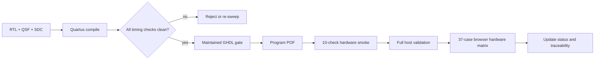

# Build Flow: Quartus Project

**Directory:** `hdl/proj/`

## Current target

| Property | Value |
|---|---|
| FPGA | Intel MAX 10 `10M08SAU169C8G` |
| Package | 169-ball UFBGA |
| Speed grade | C8 |
| Toolchain | Quartus Prime Lite 25.1 |
| Default profile | `FAST_SPEED=true`, `FAST_RAW_BUILD=false` |
| Default fitter seed | 10 |
| Logic use | 7,713/8,064 LEs (96%) |
| Registers / memory | 4,802 registers; 38,020/387,072 memory bits |

## Project inputs

| File | Purpose |
|---|---|
| `OLS_Logic_Analyzer.qpf` | Quartus project |
| `OLS_Logic_Analyzer.qsf` | Generated device, source, fitter, and assignment settings |
| `OLS_Logic_Analyzer.sdc` | Clock, I/O, and CDC constraints |
| `pin_assignments.csv` | Board pin source used to generate the wrapper |
| `OLS_Logic_Analyzer_wrapper.vhd` | Generated top-level wrapper; overwritten by the build |
| `compile.ps1` | Wrapper/QSF generation, compile, optional persistent programming |
| `seed_sweep.ps1` | Multi-seed timing sweep |
| `WIDE_DIVIDER_REBUILD.md` | 24-bit generator-divider build and validation record |

## Compile and program

`compile.ps1` locates Quartus through `$env:QUARTUS_DIR`, defaulting to
`C:\altera_lite\25.1std\quartus\bin64`:

```powershell
cd hdl\proj
.\compile.ps1 -NoFlash -Seed 10
.\compile.ps1 -Flash -Seed 10
```

Parameters:

| Parameter | Meaning |
|---|---|
| `-Seed` | Fitter seed; default 10, the best current full-build result |
| `-NoFlash` | Compile without programming |
| `-Flash` | Program `output_files\OLS_Logic_Analyzer.pof` into CFM |
| `-RawOnly` | Set `FAST_RAW_BUILD=true` and omit the packed MSO pipeline |
| `-LegacyClkForward` | Use the old direct PLL c4 SDRAM clock instead of DDIO forwarding |

The script regenerates the wrapper and QSF, then runs the normal Quartus flow
through assembly and STA. `-Flash` deliberately uses the POF rather than an
SOF so the image survives power cycling. On the current Quartus 25.1 bench,
the MAX1000 JTAG interface also requires the Arrow USB-Blaster plugin from
Arrow USB Programmer2.

## Timing gate

The current seed-10 result is from the slow 1200 mV, 85 C setup corner:

| Domain | Setup slack | Hold slack |
|---|---:|---:|
| `fast_clk` | +0.253 ns | +0.291 ns |
| `sdram_core_clk` | +0.178 ns | +0.340 ns |
| `sys_clk` | +0.278 ns | +0.223 ns |
| `SDRAM_CHIP_CLK_OUT` | +1.098 ns | +1.808 ns |
| `SPI_SCK_EXT` | +12.025 ns | +0.394 ns |

The latest timing fix represents the fast capture sample budget as a modular
carry-chain accumulator, keeps packed ready registered, and separates the
continuous-budget reload pulse from the wide seed mux. This removes the live
22-bit equality/control cone from the 200.4 MHz capture path.

The build is seed-sensitive. A 48-seed sweep found seed 10 best; seed 39 was
next at only +0.014 ns overall and most placements failed timing. Re-run a
seed sweep after any RTL, pin, SDC, QSF, tool-version, or fitter-option change:

```powershell
.\seed_sweep.ps1 -Seeds @(1,2,3,4,5,6,7,8,9,10)
```

Do not inherit timing or hardware-validation claims from an older image.
Review all setup, hold, recovery/removal, minimum-pulse-width, I/O, and CDC
reports before programming.

## Generated evidence

The signoff artifacts are under `hdl/proj/output_files/`:

| Artifact | Use |
|---|---|
| `OLS_Logic_Analyzer.fit.summary` | Device, utilisation, and fitter status |
| `OLS_Logic_Analyzer.sta.summary` | Per-domain timing gate |
| `OLS_Logic_Analyzer.asm.rpt` | Assembler status and SOF checksum |
| `OLS_Logic_Analyzer.sof` | Volatile SRAM image |
| `OLS_Logic_Analyzer.pof` | Persistent CFM image |

The current assembler checksum is `0x00504799`. A checksum identifies a build
for bench records; it is not a cryptographic integrity proof. The current SOF
SHA-256 is recorded in [Current Status](../current-status.md).

## Verification sequence



## Build profiles

| Profile | `FAST_SPEED` | `FAST_RAW_BUILD` | Purpose |
|---|---:|---:|---|
| Full (default) | true | false | Shipping mixed-signal image with packed MSO and 24-bit generator divider |
| Raw-only | true | true | Diagnostic image without the packed MSO pipeline |
| Slow/debug | false | profile-specific | Low-speed simulation or hardware investigation |

The current timing and connected-board claims apply only to the full seed-10
profile. See [Wide-Divider Rebuild](../../../hdl/proj/WIDE_DIVIDER_REBUILD.md)
and [Verification Traceability](../verification-traceability.md).
