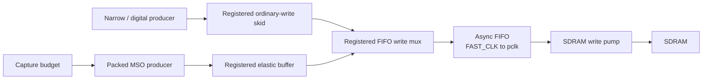

# FAST capture stream seams

The FAST capture producer runs in `FAST_CLK` and ultimately feeds the
write-side of the asynchronous FIFO in `Fast_Logic_Analyzer_SDRAM`.

The two producer paths remain independently backpressured until the final
registered mux. This is the timing seam: producer control and budget logic are
kept out of the asynchronous FIFO pin path, while the FIFO and SDRAM pump
preserve ordering and absorb clock-domain latency.

## Capture budget

[`fast_capture_budget.vhd`](../../../hdl/rtl/fast_capture_budget.vhd) is the
single-owner budget seam. A `consume` event represents one accepted output
word. `load` establishes the requested count; single-shot mode emits a
one-cycle `done` pulse on the final consume, while continuous mode reloads the
configured count. The module uses a fixed-width `unsigned` counter rather than
an unconstrained arithmetic `natural` path.

Its edge cases are covered by
[`tb_fast_capture_budget.vhd`](../../../hdl/tb/tb_fast_capture_budget.vhd):
reset, single-shot exhaustion, final-word done, and continuous reload.

## Elastic buffer

[`fast_capture_elastic_buffer.vhd`](../../../hdl/rtl/fast_capture_elastic_buffer.vhd)
is a two-entry registered valid/ready buffer. It has no fall-through path and
holds `out_data` stable while `out_valid=1` and `out_ready=0`. It accepts a
replacement word on a simultaneous pop, so the producer can remain decoupled
from short FIFO backpressure without losing ordering.

The invariants are exercised by
[`tb_fast_capture_elastic_buffer.vhd`](../../../hdl/tb/tb_fast_capture_elastic_buffer.vhd):
fill, full-state readiness, stalled-head stability, simultaneous pop/push, and
final drain.

The registered-ready buffer is integrated at the packed FIFO boundary, keeping
`packed_mode_f` off the async FIFO write-port control path.

A later timing pass (2026-07-23) registered the Packed_Ready five-term AND
(`Packed_Ready_r`) and the packed-mode valid/data path into the elastic buffer
(`packed_buf_in_valid_r`, `Packed_Data_r`) to break the cross-hierarchy
  combinational path to `analog_packer`'s BRAM address register. Those stages
  remain in the current full MSO image. The later Quartus 25.1 seed-10 build
  reports **+0.253 ns** slow-85C FAST setup slack and **+0.178 ns** for the
  SDRAM core. See [Capture Engine](capture-engine.md) for the detailed stages.

The current board validation is the 2026-09-09 seed-10 image with
SOF checksum `0x0050492F`; see
[Verification and Change Traceability](../verification-traceability.md).

The budget is represented as a modular carry-chain accumulator. Carry is the
terminal event, so no wide equality comparator sits in the producer control
cone. Continuous reload is a separate registered pulse, while one-shot capture
uses the same carry to stop exactly at the requested sample count. The raw-only
build remains available as a diagnostic profile.

An earlier combinational-ready integration worsened setup to `-0.284 ns` and
was rejected by the timing gate.

## Integration rule

Any future live integration must prove all of the following before flashing:

1. all standalone GHDL assertions pass;
2. full Quartus analysis, fitting, assembly, and STA succeed;
3. slow-85C setup slack is non-negative for `sys_clk`, `fast_clk`, and
   `sdram_core_clk`;
4. hardware capture counts and packed-stream ordering pass on the board.
