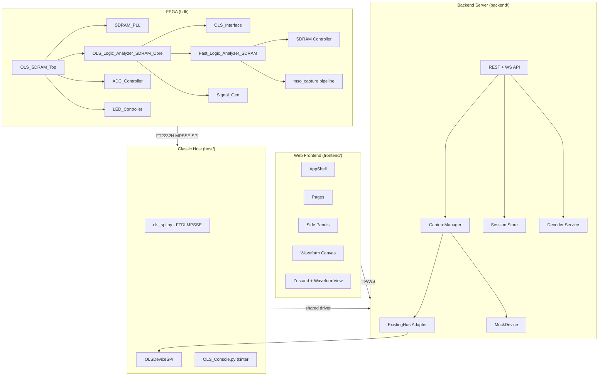

# OLS Logic Analyzer — Project Wiki

> A mixed-signal logic analyzer, capture backend, and signal-generator stack for the Arrow MAX1000 board (Intel MAX 10 10M08).

## Repository Layout

| Directory | Purpose |
|---|---|
| `hdl/` | FPGA RTL (VHDL), Quartus project, constraints, testbenches |
| `backend/` | FastAPI Python backend server |
| `frontend/` | React/TypeScript web UI |
| `host/` | Python host driver (SPI + device class) and tkinter app |
| `docs/` | Design notes, ADRs, (this wiki) |

## Wiki Sections

- [Current Implementation Status](current-status.md) - validated hardware contract, supported routes, limits, and verification baseline
- [Generator Routing and Bit Banger Contract](generator-routing.md) - two-output engine, RS-485 DE, SPI CS/MISO, pin pool, and registers
- [Hardware Validation](hardware-validation.md) - real-board smoke tests, PWM regression, compression matrix, and full validation

- [HDL — FPGA Design](hdl/README.md) — VHDL entities, clock domains, SDRAM controller, capture pipeline, signal generator, testbenches, build flow
- [Backend — Python Server](backend/README.md) — FastAPI app, hardware abstraction, capture manager, session model, decoders, exports, WebSockets
- [Frontend — Web UI](frontend/README.md) — React components, state management, waveform viewer, API client, E2E tests

## Key Architecture Decisions

- **ADR-001**: [Capture Mode Strategy Pattern](../adr/001-capture-strategy-pattern.md) — decomposed monolithic `capture()` into 5 strategy classes
- **ADR-002**: [Wire Format Extraction](../adr/002-wire-format-extraction.md) — extracted pure wire-format functions from 2355-line driver into `wire_format.py`

## Current Status

- 16-channel digital capture at 200.4 MHz
- 4,194,304-word SDRAM single-shot depth
- Analog-fast (1 ADC lane), analog-all (4 lanes), mixed (digital + analog) modes
- Narrow packed digital (200 MHz, 1 channel)
- UART, I²C, SPI, RS-485, SWD, raw Bit Banger, and PWM generation
- Hardware route capabilities advertise optional RS-485 DE and SPI CS/MISO auxiliary routes
- Register-controlled debug CH0 PWM loopback for hardware self-test
- Exact full-word RLE readback compression (`raw` / `delta_rle` host modes)
- Built with Quartus, targeting 10M08DAF484C8G, FAST_SPEED build
- SDRAM write timing is closed in STA with the DDIO-forwarded chip clock. The
  corrected full mixed-signal build uses **seed 21** (2026-07-21): worst setup
  slack `fast_clk -0.139 ns`, `sdram_core_clk +0.172 ns`,
  `sys_clk +0.492 ns`, `SDRAM_CHIP_CLK_OUT +1.098 ns`; 94% LE
  (7,564/8,064). The analog-packer output remains bit-exact under
  backpressure; setup timing is not yet closed; see
  [`hdl/sdram-pll.md`](hdl/sdram-pll.md) for the DDIO clock-forward phase fix,
  [`hdl/mso-capture.md`](hdl/mso-capture.md) for the packed/MSO live-capture
  throughput fix, and `TIMING_REPORT_SUMMARY.md` for the full per-domain
  history. Re-sweep with `hdl/proj/seed_sweep.ps1` after any RTL change —
  this design is seed-sensitive at this density.
- Live/continuous compressed digital capture (packed/MSO mode) sustains
  ~90-105 MS/s effective 16-channel throughput plus ~25-30 kS/s per analog
  channel simultaneously — see [`hdl/mso-capture.md`](hdl/mso-capture.md#rate-behavior-and-livecontinuous-capture).
  The legacy `MODE_MIXED`/read-side-RLE paths are unchanged and much lower
  (~0.14 MS/s and ~2 MS/s respectively) — packed mode is the one to use for
  a fast compressed live view.
