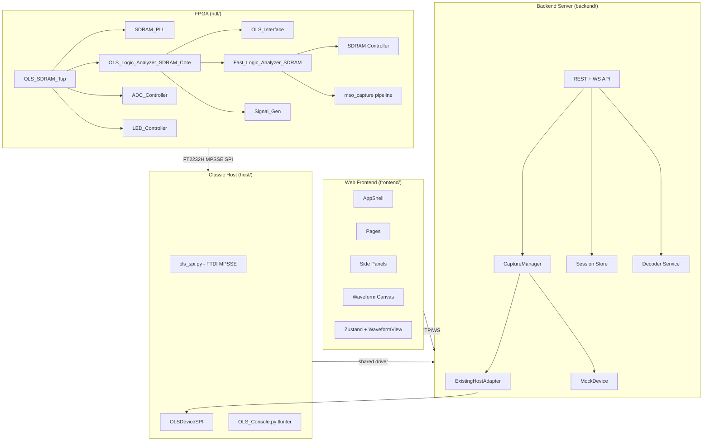

# OLS Logic Analyzer — Project Wiki

> A mixed-signal logic analyzer, capture backend, and signal-generator stack for the Arrow MAX1000 board (Intel MAX 10 10M08).

## Repository Layout

| Directory | Purpose |
|---|---|
| `hdl/` | FPGA RTL (VHDL), Quartus project, constraints, testbenches |
| `backend/` | FastAPI Python backend server |
| `frontend/` | React/TypeScript web UI |
| `host/` | Python host driver (SPI + device class) and tkinter app |
| `docs/` | Design notes, ADRs, (this wiki) |

## Wiki Sections

- [Current Implementation Status](current-status.md) - validated hardware contract, supported routes, limits, and verification baseline
- [Generator Routing and Bit Banger Contract](generator-routing.md) - two-output engine, RS-485 DE, SPI CS/MISO, pin pool, and registers
- [Hardware Validation](hardware-validation.md) - real-board smoke tests, PWM regression, compression matrix, and full validation
- [Feature and Coverage Matrix](feature-matrix.md) - cross-layer feature inventory, implementation locations, and evidence
- [On-board LIS3DH Accelerometer](accelerometer.md) - physical wiring, I²C/SPI access, live capture, and validation

- [HDL — FPGA Design](hdl/README.md) — VHDL entities, clock domains, SDRAM controller, capture pipeline, signal generator, testbenches, build flow
- [Backend — Python Server](backend/README.md) — FastAPI app, hardware abstraction, capture manager, session model, decoders, exports, WebSockets
- [Frontend — Web UI](frontend/README.md) — React components, state management, waveform viewer, API client, E2E tests

## Key Architecture Decisions

- **ADR-001**: [Capture Mode Strategy Pattern](../adr/001-capture-strategy-pattern.md) — decomposed monolithic `capture()` into 5 strategy classes
- **ADR-002**: [Wire Format Extraction](../adr/002-wire-format-extraction.md) — extracted pure wire-format functions from 2355-line driver into `wire_format.py`

## Current Status

- 16-channel digital capture at 200.4 MHz
- 4,194,304-word SDRAM single-shot depth
- Analog-fast (1 ADC lane), analog-all (4 lanes), mixed (digital + analog) modes
- Narrow packed digital (200 MHz, 1 channel)
- UART, I²C, SPI, RS-485, SWD, raw Bit Banger, and PWM generation
- Hardware route capabilities advertise optional RS-485 DE and SPI CS/MISO auxiliary routes
- Register-controlled debug CH0 PWM loopback for hardware self-test
- Readback compression (`raw` / direct `rle` / packed `delta_rle` modes)
- Built with Quartus, targeting Intel MAX 10 `10M08SAU169C8G`, FAST_SPEED build
- SDRAM write timing is closed in STA with the DDIO-forwarded chip clock. The
  current full mixed-signal build uses **seed 23** (2026-07-21): the
  authoritative post-fit query reports worst setup slack `fast_clk +0.049 ns`
  in the slow corner, with all setup/hold paths positive. The analog-packer
  output remains bit-exact under backpressure.
  The image is currently programmed on the validation board; see
  [`hdl/sdram-pll.md`](hdl/sdram-pll.md) for the DDIO clock-forward phase fix,
  [`hdl/mso-capture.md`](hdl/mso-capture.md) for the packed/MSO live-capture
  throughput fix, and `TIMING_REPORT_SUMMARY.md` for the full per-domain
  history. Re-sweep with `hdl/proj/seed_sweep.ps1` after any RTL change —
  this design is seed-sensitive at this density.
- The exact programmed image passed the packed/MSO hardware check with
  500,000 words, four balanced analog channels, and digital RLE slices. Live
  readback characterization measured approximately 1.00 MS/s raw and
  0.50 MS/s lossless `delta_rle` on the current USB path; see
  [`hdl/mso-capture.md`](hdl/mso-capture.md#rate-behavior-and-livecontinuous-capture).
