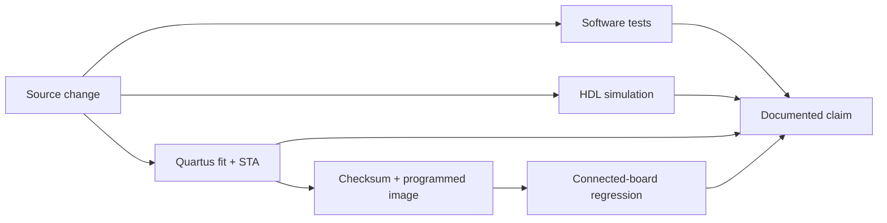

# Verification and Change Traceability

This page separates source coverage, simulation, post-fit timing, and
connected-board evidence. A feature is not hardware-validated merely because
its source or simulation exists.

## Evidence levels

| Level | Meaning |
|---|---|
| **SW** | Host/backend/frontend tests; no FPGA or board claim |
| **SIM** | Focused or maintained HDL simulation |
| **BUILD** | Quartus fit succeeds and all required timing checks close |
| **HW** | The exact programmed image passes the relevant board test |

## Current signoff record

| Field | Current evidence |
|---|---|
| Source baseline | `master`, through `1598b9b` plus the documented wiki update |
| Build | Quartus Prime Lite 25.1, full mixed-signal profile, fitter seed 10 |
| Image | Programmed to CFM on 2026-08-27; SOF checksum `0x0050ADC8` |
| Timing | Slow-85C setup: fast +0.083 ns, SDRAM +0.111 ns, system +0.410 ns; all setup/hold checks positive |
| Hardware smoke | 10/10 |
| Full hardware suite | 383/383 |
| Browser hardware matrix | 37/37, manifest timestamp 2026-08-27 |
| Rate sweep | 1,200-115,200 baud within +0.79% |

The complete matrix manifest and per-case session IDs are in
[`hardware-validated-matrix.json`](../../frontend/test-results/screenshots/hardware-validated-matrix.json).
The fit, STA, and assembler reports are in `hdl/proj/output_files/`.

## Change-to-evidence matrix

| Change | Primary implementation | Evidence | Level |
|---|---|---|---|
| Live waveform request correlation and coalescing | `frontend/src/workers/`, `waveformStore.ts`, session persistence | Worker unit tests, frontend build/E2E, live hardware captures | **SW + HW** |
| Generator output during rolling capture | backend adapter, host driver, Generator page | Backend/host tests; live generator capture and clean stop | **SW + HW** |
| Exact generator rate and corrected square preset | generator preview/status and host divider model | Protocol/unit tests and on-wire rate sweep | **SW + HW** |
| 24-bit `REG_GEN_BAUD` and metadata feature byte | `Bit_Engine`, `OLS_Interface`, core/top wiring, host detection | `tb_bit_engine_div24`, Quartus seed sweep, rate sweep | **SIM + BUILD + HW** |
| SDRAM init comparator register | `SDRAM_Controller_Custom.vhd` | Post-fit STA, full hardware regression | **BUILD + HW** |
| Auto-discovered analogue jumper fixture | `host/app/hw_validation.py` | Full 383-check suite; clean skip without fixture | **HW** |
| Bounded final SPI plateau decode | `host/app/gui_decoders.py` | Host tests and full connected-board suite | **SW + HW** |
| Expanded regression/coverage gates | CI workflows, backend/host/frontend tests, HDL runner | Backend 88% and host 50% branch thresholds; unit/E2E/HDL jobs | **SW + SIM** |

## Historical image records

| Date | Image | Result | Status |
|---|---|---:|---|
| 2026-07-22 | seed 23, SOF `0x004FDDF3` | 369/369 | Historical |
| 2026-07-23 | seed 44, SOF `0x00515DB0` | 358/358 | Historical |
| 2026-07-27 | repaired seed 30, SOF `0x0050CF93` | 391/391 after focused corrections | Historical |
| 2026-08-07 | pin-map/pull-up image, SOF `0x0051801E` | smoke 10/10 | Historical |
| 2026-08-27 | seed 10 wide-divider, SOF `0x0050ADC8` | 383/383 + 37/37 | Current |

Historical results remain useful regression evidence, but they do not prove a
later RTL image. The current claim always follows the newest programmed image
that has both a clean build and a complete relevant board run.

## CI and local gates

| Gate | Command/workflow | Contract |
|---|---|---|
| Backend | `python -m pytest backend/app/tests` | Branch coverage threshold 88% |
| Host | `python -m pytest host/tests host/driver/tests` | Branch coverage threshold 50% |
| Frontend unit | `npm run test:unit` | Binary parser, WebSocket, and waveform worker/client coverage |
| Frontend E2E | `PLAYWRIGHT_USE_MOCK=1 npm run test:e2e -- hardware.spec.ts` | Browser workflows without hardware |
| HDL gate | `bash hdl/tb/run_all_tbs.sh` | Every non-excluded `tb_*.vhd` must terminate explicitly and pass |
| HDL expected failures | `SUITE=known-failures bash hdl/tb/run_all_tbs.sh` | XFAIL remains visible; unexpected pass fails until reclassified |
| Hardware matrix | `.github/workflows/hardware-matrix.yml` | Self-hosted `max1000` runner; board absence is a failure |

## Audit rules

- Record source baseline, profile, fitter seed, tool version, image checksum,
  test date, and result beside every new **HW** claim.
- Re-run post-fit STA after any RTL, SDC, QSF, pin, fitter, or toolchain
  change. Seed 10 is not evidence for modified inputs.
- Keep missing external fixtures explicit. A decoder test does not prove CAN,
  LIN, SWD, JTAG, or MIL electrical interoperability.
- Do not merge known-failing HDL benches into a nominal pass count. Repair and
  move them back into the maintained gate when they explicitly terminate.
- Update [Current Status](current-status.md), the
  [Feature Matrix](feature-matrix.md), and [Hardware Validation](hardware-validation.md)
  whenever the current image or board baseline changes.

## Evidence locations

| Evidence | Location |
|---|---|
| HDL tests and classification | [`hdl/tb/`](../../hdl/tb/) and [HDL Testbenches](hdl/testbenches.md) |
| Quartus build and timing | [`hdl/proj/`](../../hdl/proj/) and [Build Flow](hdl/build-flow.md) |
| Connected-board validation | [`host/app/hw_validation.py`](../../host/app/hw_validation.py) and [Hardware Validation](hardware-validation.md) |
| Backend and host tests | [`backend/app/tests/`](../../backend/app/tests/) and [`host/driver/tests/`](../../host/driver/tests/) |
| Frontend unit/E2E evidence | [`frontend/`](../../frontend/) and [Frontend Build & Test](frontend/build-and-test.md) |
