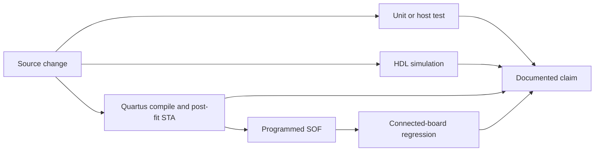
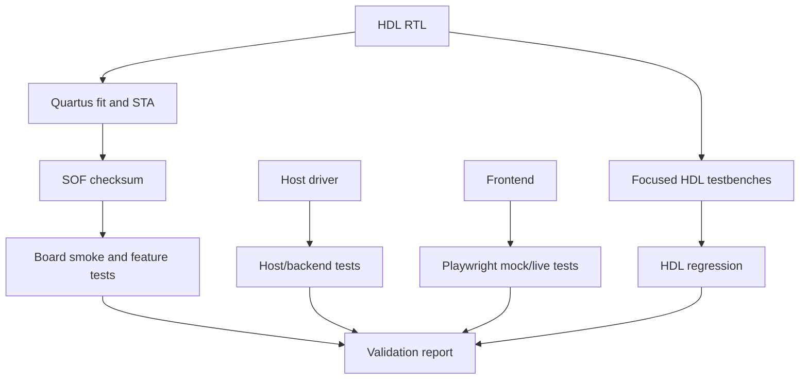

# Verification and Change Traceability

This page is the audit index for changes that affect the FPGA image, host
driver, backend contract, or frontend behavior. A feature is not considered
hardware-validated merely because its source or simulation test exists.

## Evidence chain

The evidence levels used below are:

| Level | Meaning |
|---|---|
| SW | Host, backend, or frontend tests only; no FPGA claim |
| SIM | HDL testbench passes in simulation |
| BUILD | RTL compiles and required post-fit timing paths close |
| HW | Exact programmed image passes the relevant connected-board test |

## Current exact-image hardware validation

The current repaired seed-30 image (`0x0050CF93`) was rerun on 2026-07-27.
The baseline run was **357/380 passed, 23 failed, 0 skipped**. Focused post-fix
regression is **117/117 passed**, with capture-visible LIS3DH I²C/SPI decode
passing.
The final exhaustive suite is **387/387 passed, 0 failed, 0 skipped**.

The earlier seed-23 validation remains historical evidence: it recorded
**369/369 passed, 0 failed, 0 skipped** on 2026-07-22 with checksum
`0x004FDDF3`.

## Changes since the previous complete hardware validation

| Commit | Change | Documentation | Evidence status |
|---|---|---|---|
| `07637559` | Register `Packed_Ready_r`, `packed_buf_in_valid_r`, `Packed_Data_r` for 200 MHz timing closure; dcfifo multicycle constraint; seed 23 to 44; Tests 14f, 14g | [Capture Engine](hdl/capture-engine.md), [Hardware Validation](hardware-validation.md), [Current Status](current-status.md) | **BUILD + HW** on SOF `0x00515DB0` |
| `032137d8` | Add configure_pattern_trigger mock to FakeHostDevice for backend CI | [Backend Tests](../../backend/app/tests/test_existing_host_adapter.py) | **SW** (backend tests 325/325) |
The latest complete board evidence is the 2026-07-22 run documented in
[Hardware Validation](hardware-validation.md). Any later RTL change requires
the build, image checksum, and relevant hardware test result to be recorded
before changing a claim from BUILD or SIM to HW.

## Verification layers

## Audit rules

- Record the commit, build profile, fitter seed, SOF checksum, and test date
  beside every HW claim.
- Keep simulation-only and host-only evidence explicitly labelled; neither
  proves board routing, clock timing, or electrical response.
- Re-run post-fit STA after RTL, SDC, QSF, or fitter changes. The FAST build is
  seed-sensitive at its current 98% logic utilisation.
- Update this page and the [Feature Matrix](feature-matrix.md) when a new
  hardware-facing register, route, capture mode, or validation boundary is
  introduced.

## Evidence locations

| Evidence | Location |
|---|---|
| HDL testbenches | [`hdl/tb/`](../../hdl/tb/) and [HDL Testbenches](hdl/testbenches.md) |
| Quartus build and STA | [`hdl/proj/`](../../hdl/proj/) and [Build Flow](hdl/build-flow.md) |
| Connected-board regression | [`host/app/hw_validation.py`](../../host/app/hw_validation.py) and [Hardware Validation](hardware-validation.md) |
| Backend and host tests | [`backend/app/tests/`](../../backend/app/tests/) and [`host/driver/tests/`](../../host/driver/tests/) |
| Frontend E2E evidence | [`frontend/tests/e2e/`](../../frontend/tests/e2e/) and [Frontend Build & Test](frontend/build-and-test.md) |
